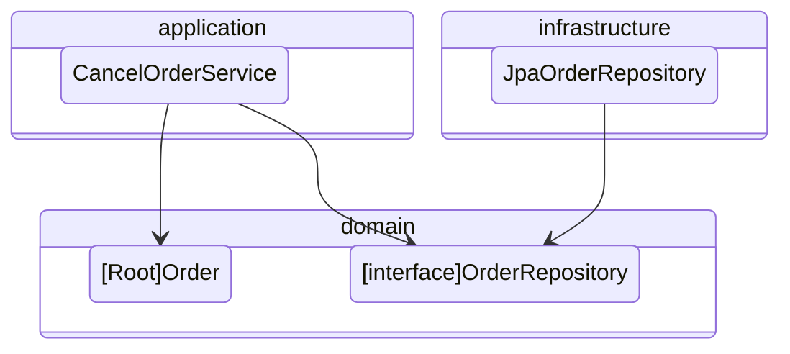
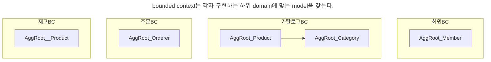

# [도메인 주도 개발 시작하기](https://product.kyobobook.co.kr/detail/S000001810495)
### DDD 핵심 개념 정리부터 구현까지

> 아래의 내용은 책을 읽고 느낀점과 정리한 내용에 대해 작성하였습니다.

## [chatper1 도메인 모델 시작하기](https://github.com/hwangintae/ddd-study/pull/1)

도메인을 어떻게 하면 잘 설계할 수 있을까?

도메인 모델의 핵심은 의사소통에 있다고 생각한다. 코드를 보고 어떤 의도와 의미를 가지고 있는지
쉽게 판단이 될 수록 잘 설계되었다고 말할 수 있다.
 
책에 언급된 것처럼 '도메인을 잘 이해하는데 도움이 된다면 어떤 방식이든 상관없다'라는 말에 공감한다.

## [chapter2 아키텍처 개요](https://github.com/hwangintae/ddd-study/blob/main/docs/chapter2/README.md)

commit list
- [feat/ 계층 구조 아키텍처 예제](https://github.com/hwangintae/ddd-study/commit/8718bcde2665078607c7d4de179b0bcee4b79b7b)
- [feat/ DIP 적용](https://github.com/hwangintae/ddd-study/commit/9fd78c40a9560f1289ef1f31c8facc356ea89154)
- [feat/ OrderRepository interface 추가](https://github.com/hwangintae/ddd-study/commit/520cf7f582e5910462ba17a0ccb4fc93f6518af3)

> [!note]
> main branch에 잘못 push 해서 PR이 없음..

DDD를 공부하게된 계기가 있다.
1. aggregate가 뭐지?
2. service랑 domain service의 차이는 뭐지?

chapter2에서 자세히 다루지 않아 명확히 알지는 못하지만

1. aggregate 는 연관된 domain의 집합
2. domain service는 여러 domain으로 만들어야 하는 기능

이라고 이해했다.

책을 읽으면서 '아 내가 패키지에 대한 강박이 있구나'를 느낀 부분이 있는데

바로 <u>Repository interface는 도메인 기능에 대한 추상화 이므로 domain layer에 있어야 한다.</u> 였다.

> 도메인 모델 관점에서 OrderRepository는 도메인 객체를 영속화하는 데 필요한 기능을 추상화한 것으로 고수준 모듈에 속한다. 기반 기술을 이용해서 OrderRepository를 구현한 클래스는 저수준 모듈로 인프라스트럭처 영역에 속한다.

단순히 repository이니까~ infrastructure에 있어야지~ 라는 생각이였다.

또 Service layer 또는 application layer가 있고 dir 내부에 OOOService 형태로 class를 관리할텐데

> domain이 복잡하면 domain model과 domain service를 다음과 같이 별도 패키지에 위치시킬 수도 있다.
> - com.myshop.order.domain.order: aggregate 위치
> - com.myshop.order.domain.service: domain service 위치

라는 글을 보고 <u>'도메인 관점에서 바라봐야 하는구나!'</u>를 느꼈다.

과격하게 말하면 **domain 관점**에서 **application은 중요한게 아니고**
**domain 간의 상호관계**에 중점을 두고 **domain을 이용하여 어떻게 service를 할지를 고민**해야한다.

## [chapter3 aggregate](https://github.com/hwangintae/ddd-study/pull/2)
아직까지 domain server와 application service의 차이점에 대해 명확하게 설명을 하지 못하겠다.

이번 chaper에서 aggregate를 이용하여 다른 aggregate를 생성하는 **3.6 aggregate를 팩토리로 사용하기** 를 읽고 짐작해보면

어떤 시나리오가 있을 때 이 시나리오의 domain 객체를 aggregate라 하고 여기서 domain의 행위를 domain service라 하고
application service는 domain의 상태를 변경하는? 역할을 하는거 같다.

예를들어 상품 주문서 작성은 application service에서 상품 주문서 작성 이라는 함수를 만들고, 상품 주문서를 작성하는데 필요한
domain들의 행위(이런 조건에서는 상품의 상태를 변경할 수 없다와 같은)는 domain과 domain service에서 하는거 같다.

책에 구체적으로 나와있지 않아 답답하다. chapter6, chapter7에 해당 내용이 나오는데 빨리 읽고 싶다.

## [chatper4 repository와 model 구현](https://github.com/hwangintae/ddd-study/pull/3)

이번 chapter를 읽으면서 가장 중요하다고 느낀 부분은 aggregate와 관련된 정보를 어떻게 로딩할 것인가 이다.
평소 JPA를 사용할때 어떠한 연관관계를 걸지않고, FK를 이용한 조회를 사용하였다. 그래서 좀 힘들었다.

그리고 JPA를 사용할 때 JPA를 domain으로 사용하는지 아니면 따로 POJO 객체로 domain을 만드는지에 대한 이야기가
개발자 단톡방에서 종종 나온다.
- JPA는 표준이기 때문에 domain으로 사용해야 한다.
- spring을 그냥 POJO로 생각해라

등등 말이 오고간다.

나는 Repository의 경우에만 interface를 사용하여 DIP를 지키는 것을 선호 한다. 왜나하면
findBy000으로 인한 service 코드가 길어지는게 싫기 때문이다.

그냥 식별자로 찾는데 굳이 findById, findByEmail 이렇게 할 필요가 없다고 생각한다.
findBy(UserId id), findBy(Email email) 등으로 시그니처가 다르기만 하면 충분히 구분되어 조회할 수 있기 때문이다.

## [chapter6 application service와 presentation](https://github.com/hwangintae/ddd-study/pull/4)

> [!note]
> chapter5는 JPA에 대한 내용이고, chapter6의 일부는 DDD와 관련 없는 내용이라 생략함

이번 chapter에서는 application service에 대해 설명하고 있다. 본격적으로 chapter7에서 domain service에 대해 설명하기 위해
나 처럼 DDD에 잘 모르는 사람을 위해 한번 설명하는 chapter라 생각한다.

가장 인상 깊은 부분은 validation 하는 부분이다. 지금까지 validation을 하라고 하면 바로 Exception으로 throw 하곤 했다.
그런데 책에서는 **매번 사용자가 어디가 틀렸는지 확인을 해야하기 때문에 한번에 알고 싶어 할 수 있다.** 라는 사용자 관점의 validation에 대해
언급하였다. 요즘은 로그인 시 브라우저에 id, pw가 저장되어 틀릴 걱정이 많이 없고, 때에 따라서는 회원가입 시 이름, 전화번호, 주소까지
자동완성 기능이 있다. 그렇기 때문에 **한번에 validation check를 하고 throw 해야지** 라는 생각을 못했던거 같다.

설계를 어떻게 interface를 만들까 말까 하는것도 중요하지만 **사용자가 어디서 불편해 할 수 있을까?**를 먼저 고민하는 습관을 가져야겠다.

## [chapter7 domain service](https://github.com/hwangintae/ddd-study/pull/5)

드디어 domain service와 application service의 차이에 대해 알게된 chapter다.

먼저 domain service는 aggregate와 관련이 있다. 책 내용 중에
- 해당 로직이 aggregate의 상태를 변경하거나
- aggregate의 상태 값을 계산하는지 확인
라고 되어 있다.

즉, 여러 aggregate를 사용하여 특정 aggregate가 변경이 된다면 하나의 aggregate의 기능으로 추가하기 애매한 부분이 있어
따로 domain service로 분리하여 사용한다.

그렇다면 application service는 뭐라고 할 수 있을까?

레이어드 아키텍처에서 보면 사용자는 presentation을 통해 접근을 한다. application은 presentation과 domain을 연결해주는 역할을 한다.
그렇기 때문에 application service는 유즈케이스로 domain과 domain service를 이용해 사용자에게 기능을 제공하는 역할을 한다.
이때 가장 중요한 역할은 transaction을 이용하여 데이터의 일관성을 보장하는 역할을 한다.

## [chapter8 aggregate transaction 관리](https://github.com/hwangintae/ddd-study/pull/6)
동시성 문제를 해결하기 위해 선점 방식(비관락)과 비선점 방식(낙관락)을 설명하는 내용이다.

동시성 문제란 공유자원을 수정할 때 발생하는 문제인데 대표적으로 DB락을 이용해서 해결할 수 있다.

해당 chapter도 도메인 주도 설계 보단 application 개발을 할때 back-end 개발자가 고려해야 하는 문제에 대해서 설명하는
chapter라고 생각한다.

## [chapter9 domain model과 bounded context](https://github.com/hwangintae/ddd-study/pull/7)
드디어 bounded context가 무엇인지 이해가 됐다. 특정 상황에 따라 model이 의미하는 바가 다를 수 있는데 이걸 한 곳에서 표현하기가 어렵다.
이 때 bounded context는 용어를 기준으로 구분하여 model의 의미를 부여한다.

예를 들어 황인태라는 domain model이 있는데 회사원 황인태, 아들 황인태, 남자친구 황인태는 각각 다르다. 만약 이를 구현한다고 하면
(물론 황인태라고 객체를 만들진 않겠지만) 회사 컨텍스트, 가족 컨텍스트, 연인 컨텍스트에서 각각 황인태라는 model을 가지고 있을 것이다.

이젠 DDD에 대해 기초는 알게 된거 같다.

## [chapter10 event](https://github.com/hwangintae/ddd-study/pull/8)
event는 transaction의 경계를 명확하게 구분할 수 있는 중요한 방식이다.

commit 이전과 이후를 나누어 특정 작업을 진행할 수 있다. 
그리고 transaction의 구분으로 domain의 책임 또한 명확하게 구분된다.

event의 관점은 요청보단 선언에 가깝다고 생각한다.

'A의 작업이 끝났으니 리뷰 부탁드립니다.' 보단

'A 작업 끝났음.'이다. 즉, 다음 과정에 대해 알지 못해도 된다.

물론 특정 작업에서 문제가 발생했을 경우 순서에 맞게 rollback을 해야한다면.
예) 재고 복구 후 주문을 취소하고 최종적으로 환불을 진행한다.

등 event 꼬임을 방지하기 위한 노력이 필요하다.

## [chapter11 CQRS](https://github.com/hwangintae/ddd-study/pull/9)
CQRS에 대한 간단한 개념을 설명하는 chapter다.

model 관리 관점에서 query를 위한 model을 따로 만들었을 때 기존 command model에 영향을 주지 않고

성능 향상을 할 수 있다는 점에서 큰 매력으로 다가온다.