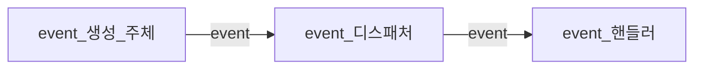
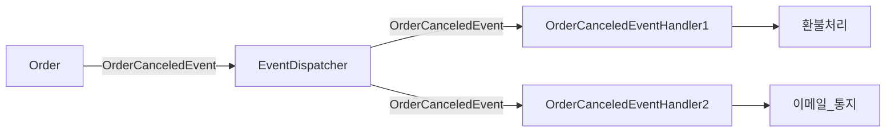
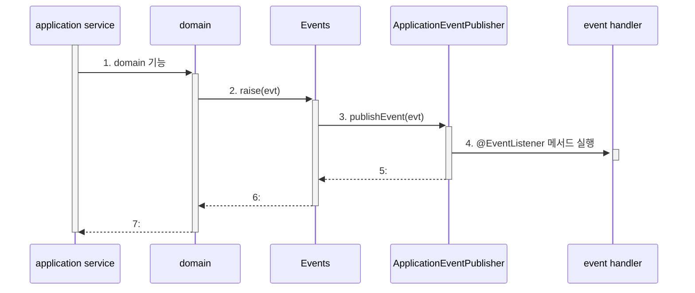
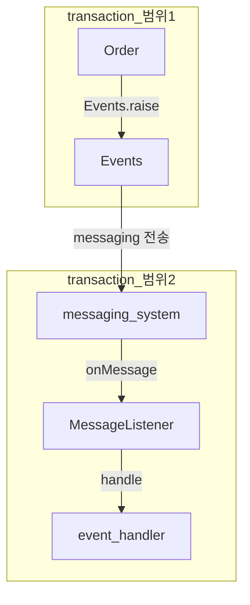
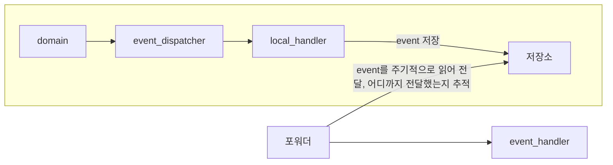
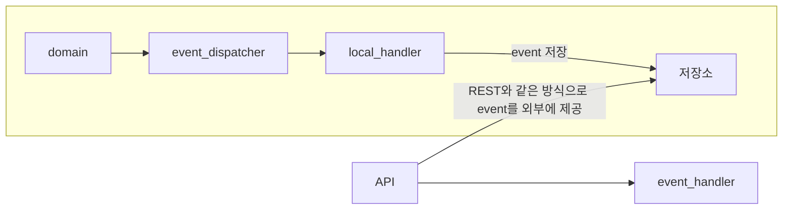
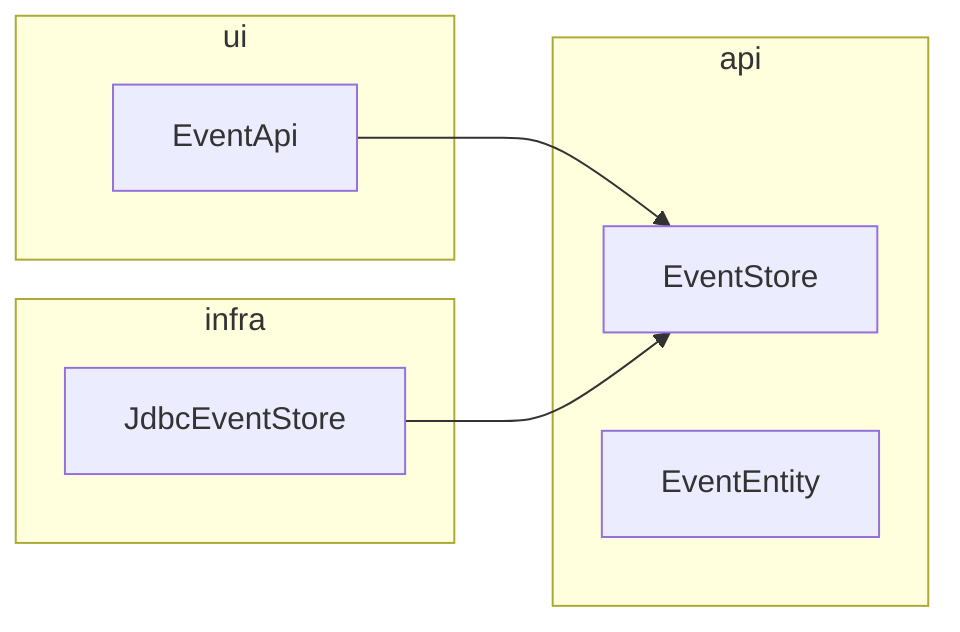
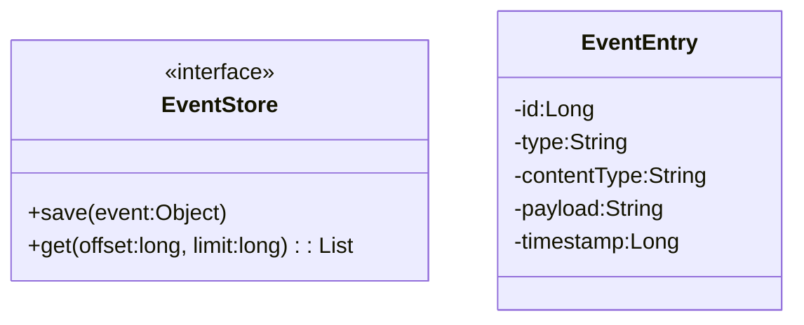
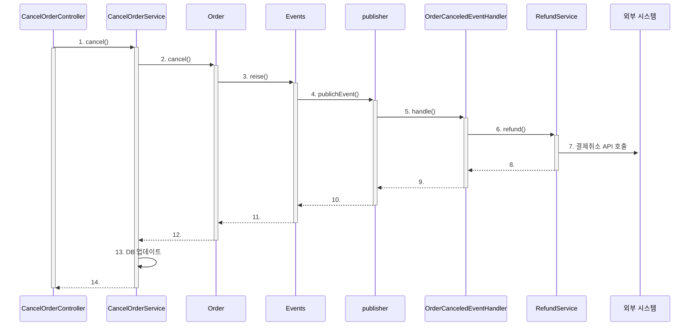
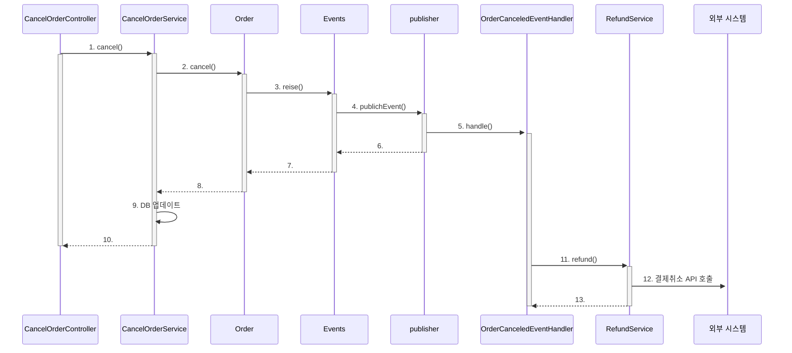

# chapter10 event


## 10.1 시스템 간 강결합 문제
domain 객체에서 환불 기능을 실행하려면 다음 코드처럼 환불 기능을 제공하는 domain service를 파라미터로 전달받고 취소 domain 기능에서 domain service를 실행하게 된다.
```java
public class Order {
	public void cancel(RefundService refundService) {

		// 주문 로직
		verifyNotYetShipped();
		this.state = OrderState.CANCELED;

		// 결제 로직
		this.refundStatus = State.REFUND_STARTED;
		try {
			refundService.refund(getPaymentId());
			this.refundStatus = State.REFUND_COMPLETED;
		} catch(Exception ex) {
		}
	}
}
```

application service에서 환불 기능을 실행할 수도 있다.
```java
public class CandelOrderService {
	private RefundService refundService;

	@Transactional
	public void cancel(OrderNo orderNo) {
		Order order = findOrder(orderNo);
		order.cancel();

		order.refundStarted();
		try {
			refundService.refund(order.getPaymentId());
			order.refundCompleted();
		} catch(Exception ex) {
		}
	}
}
```

보통 결제 시스템은 외부에 존재한다. 이때 두 가지 문제가 발생할 수 있다.
1. 외부 서비스가 정상이 아닐 경우 transaction 처리를 어떻게 해야 할지 애매하다.
    1. 환불 기능을 실행하는 과정에서 exception이 발생하면 transaction rollback을 해야할까?
    2. 일단 커밋을 해야할까?
    3. 주문은 취소 상태로 변경하고 환불만 나중에 다시 시도하는 방식?
2. 외부 서비스 성능에 직접적인 영향을 받게 된다.

Order는 주문을 표현하는 domain 객체인데 결제 domain 의 환불 관련 로직이 뒤섞이게 된다.

**이것은 환불 기능이 바뀌면 Order도 영향을 받게 된다는 것을 의미한다.**

domain 객체에 service를 전달할 시 또 다른 문제는 기능을 추가할 때 발생한다. 만약 주문을 취소한 뒤에 취소했다는 내용을 통지해야 한다면 환불 domain service와 동일하게 파라미터로 통지 service를 받도록 구현하면 앞서 언급한 로직이 섞이는 문제가 더 커지고 transaction 처리가 더 복잡해진다.

**지금까지 언급한 문제가 발생하는 이유는 주문 bounded context와 결제 bounded context간의 강결합 때문이다.**

## 10.2 event 개요
domain의 상태 변경을 event로 표현할 수 있다.
- ~ 할 때
- ~ 가 발생하면
- 만약 ~ 하면
  과 같은 요구사항은 domain의 상태 변경과 관련된 경우가 많고 이런 요구사항을 event를 이용해서 구현할 수 있다.

예를 들어 '주문을 취소할 때 이메일을 보낸다'라는 요구사항에서 '주문을 취소할 때'는 주문이 취소 상태로 바뀌는 것을 의미하므로 '주문 취소됨 event'를 활용해서 구현할 수 있다.

#### 10.2.1 event 관련 구성요소


domain model에서 event 생성 주체는 entity, value, domain service와 같은 domain 객체이다.

event handler는 event 생성 주체가 발생한 event에 반응한다. event handler는 생성 주체가 발생한 event를 전달받아 event에 담긴 데이터를 이용해서 원하는 기능을 실행한다.

event 생성 주체와 event handler를 연결해 주는 것이 event dispatcher다. event를 전달받은 dispatcher는 해당 event를 처리할 수 있는 handler에 event를 전파한다.

#### 10.2.2 event의 구성
- event 종류 : class 이름으로 event 종류를 표현
- event 발생 시간
- 추가 데이터 : 주문번호, 신규 배송지 정보 등 event와 관련된 정보

배송지 변경을 위한 event
```java
public class ShippingInfoChangedEvent {
	private String orderNumber;
	private long timestamp;
	private ShippingInfo newShippingInfo;
}
```

**event는 현재 기준으로 과거에 벌어진 것을 표현하기 때문에 event 이름에는 과거 시제를 사용한다.**

위 event를 발생하는 주체는 Order aggregate다. Order aggregate의 배송지 변경 기능을 구현한 메서드는 배송지 정보를 변경한 뒤에 이 event를 발생시킬 것이다.
```java
public class Order {
	public void changeShippingInfo(ShippingInfo newShippingInfo) {
		verifyNotYetShipped();
		setShippingInfo(newShippingInfo);
		Events.raise(new ShippingInfoChangedEvent(number, newShippingInfo));
	}
}
```

event handler
```java
public class ShippingInfoCahngedHandler {
	
	@EventListener(ShippingInfoChangedEvent.class)
	public void handle(ShippingInfoChangedEvent evt) {
		shippingInfoSynchronizer.sync(
			evt.getgetOrderNumber(),
			evt.getNewShippingInfo()
		);
	}
}
```

#### 10.2.3 event 용도
event는 크게 두 가지 용도로 쓰인다.
1. 트리거 : domain 상태가 바뀔 때 다른 후처리가 필요하면 후처리를 실행하기 위한 트리거로 event를 사용할 수 있다.
2. 서로 다른 시스템 간의 데이터 동기화 : 배송지를 변경하면 외부 배송 서비스에 바뀐 배송지 정보를 전송해야 한다.

#### 10.2.4 event 장점
event를 사용하면 서로 다른 domain 로직이 섞이는 것을 방지할 수 있다.
```diff
public class Order {
	public void cancel(RefundService refundService) {

		// 주문 로직
		verifyNotYetShipped();
		this.state = OrderState.CANCELED;

		// 결제 로직
-		this.refundStatus = State.REFUND_STARTED;
-		try {
-			refundService.refund(getPaymentId());
-			this.refundStatus = State.REFUND_COMPLETED;
-		} catch(Exception ex) {
-		}

+		Events.raise(new OrderCanceledEvent(number.getNumber()));
	}
}
```



## 10.3 event, handler, dispatcher 구현
- event class : event를 표현
- dispatcher : spring이 제공하는 ApplicationEventPublisher 이용
- Events : event를 발행한다. event 발행을 위해 ApplicationEventPublisher를 사용
- event handler : spring이 제공하는 event handler 사용
#### 10.3.1 event class
event class는 처리하는 데 필요한 최소한의 데이터를 포함해야 한다.

모든 event가 발생 시간을 갖도록 하면 상위 class를 만들어 상속한다.
```java
public abstract class Event {
	private long timestamp;

	public Event() {
		this.timestamp = System.currentTimeMillis();
	}

	public long getTimestamp() {
		return timestamp;
	}
}
```

```java
public class OrderCanceledEvent extends Event {
	private String orderNumber;

	public OrderCanceledEvent(String number) {
		super();
		this.orderNumber = number;
	}
}
```

#### 10.3.2 Events class와 ApplicationEventPublisher
```java
public class Events {
	private static ApplicationEventPublisher publisher;

	static void setPublisher(ApplicationEventPublisher publisher) {
		Events.publisher = publisher;
	}

	public static void raise(Object event) {
		if (publisher != null) {
			publisher.publishEvent(event);
		}
	}
}
```

```java
@Configuration
@RequiredArgsConstructor
public class EventsConfiguration {
	private final ApplicationContext applicationContext;

	@Bean
	public InitializingBean eventsInitializer() {
		return () -> Events.setPublisher(applicationContext);
	}
}
```

#### 10.3.3 event 발생과 event handler
```java
public class Order {
	public void cancel() {
		// ...
		Events.raise(new OrderCanceledEvent(number.getNumber()));
	}
}
```

```java
@Service
@RequiredArgsConstructor
public class OrderCanceledEventHandler {
	private final RefundService refundService;

	@EventListener(OrderCanceledEvent.class)  
	public void handle(OrderCanceledEvent event) {  
	    refundService.refund(event.getOrderNumber());  
	}
}
```

#### 10.3.4 흐름 정리


## 10.4 동기 event 처리 문제
(중요한 내용 없음)

## 10.5 비동기 event 처리
'A 하면 이어서 B 하라'는 내용을 담고 있는 요구사항은 실제로 'A 하면 최대 언제까지 B하라'인 경우가 많다.

즉, 일정 시간 안에만 후속 조치를 처리하면 되는 경우가 많다.

이러한 요구사항은 event를 비동기로 처리하는 방식으로 구현할 수 있다. 다시 말해서 **'A event가 발생하면 별도 thread로 B를 수행하는 handler를 실행'** 하는 방식으로 요구사항을 구현할 수 있다.

event를 비동기로 구현하는 방법
1. local handler를 비동기로 실행하기
2. message queue를 사용하기
3. event 저장소와 event 포워더 사용하기
4. event 저장소와 event 제공 API 사용하기

#### 10.5.1 local handler 비동기 실행
spring이 제공하는 @Async 를 사용하면 손쉽게 비동기로 event handler를 실행할 수 있다.
```java
@SpringBootApplication
@EnableAsync
public class ShopApplication {
	public static void main(String[] args) {
		SpringApplication.run(ShopApplication.class, args);
	}
}
```

```java
@Service
public class OrderCanceledEventHandler {

	@Async
	@EventListener(OrderCanceledEvent.class)
	public void handle(OrderCanceledEvent event) {
		refundService.refund(event.getOrderNumber());
	}
}
```

#### 10.5.2 messaging system을 이용한 비동기 구현
Kafka나 RabbitMQ와 같은 messaging system을 사용하는 것


message queue를 사용하면 보통 event를 발생시키는 주체와 event handler가 별도 프로세스에서 동작한다.

#### 10.5.3 event 저장소를 이용한 비동기 처리
event를 일단 DB에 저장한 뒤에 별도 프로그램을 이용해서 event handler에 전달하는 것

이 방식은 domain의 상태와 event 저장소로 동일한 DB를 사용한다. 즉, domain의 상태 변화와 event 저장이 local transaction으로 처리된다.

event를 물리적 저장소에 보관하기 때문에 handler가 event 처리에 실패할 경우 포워더는 다시 event 저장소에서 event를 읽어와 handler를 실행하면 된다.

event를 일단 DB에 저장한 뒤에 별도 프로그램을 이용해서 event handler에 전달하는 것


API와 포워더 방식의 차이점은 event를 전달하는 방식에 있다.

포워더
1. 포워더를 이용해 event를 외부에 전달
2. event를 어디까지 처리했는지 추적하는 역할이 포워더에 있음

API
1. 외부 handler가 API 서버를 통해 event 목록을 가져간다.
2. event 목록을 요구하는 외부 handler가 자신이 어디까지 event를 처리했는지 기억

#### 이벤트 저장소 구현



- EventEntry
    - event 저장소에 보관할 데이터
    - event를 식별하기 위한 id
    - event type
    - 직렬화한 contentType
    - event 데이터 자체인 payload
    - timestamp를 갖는다.
- EventStore
    - event를 저장하고 조회하는 interface 제공
- JdbcEventStore
    - JDBC를 이용한 EventStore 구현 class
- EventApi
    - REST API를 이용해서 event 목록을 제공하는 controller

```java
public class EventEntry {  
    private Long id;  
    private String type;  
    private String contentType;  
    private String payload;  
    private long timestamp;  
      
    public EventEntry(String type, String contentType, String payload) {  
        this.type = type;  
        this.contentType = contentType;  
        this.payload = payload;  
        this.timestamp = System.currentTimeMillis();  
    }  
      
    public EventEntry(Long id, String type, String contentType, String payload, long timestamp) {  
        this.id = id;  
        this.type = type;  
        this.contentType = contentType;  
        this.payload = payload;  
        this.timestamp = timestamp;  
    }  
      
    public Long getId() {  
        return id;  
    }  
      
    public String getType() {  
        return type;  
    }  
      
    public String getContentType() {  
        return contentType;  
    }  
      
    public String getPayload() {  
        return payload;  
    }  
      
    public long getTimestamp() {  
        return timestamp;  
    }  
}
```

```java
public interface EventStore {  
    void save(Object event);  
    List<EventEntry> get(long offset, long limit);  
}
```

```java
public interface JpaEventStore extends JpaRepository<EventEntry, Long> {  
}
```

```java
@Repository  
@RequiredArgsConstructor  
public class EventStoreImpl implements EventStore {  
  
    private final JpaEventStore jpaEventStore;  
    private final ObjectMapper objectMapper;  
  
    private static final String APPLICATION_JSON = "application/json";  
  
    @Override  
    public void save(Object event) {  
        new EventEntry(event.getClass().getName(), APPLICATION_JSON, toJson(event));  
    }  
  
    @Override  
    public List<EventEntry> get(int offset, int limit) {  
        int page = offset / limit;  
  
        PageRequest pageRequest = PageRequest.of(page, limit);  
        Page<EventEntry> pageResult = jpaEventStore.findAll(pageRequest);  
  
        return pageResult.getContent();  
    }  
  
    private String toJson(Object event) {  
        try {  
            return objectMapper.writeValueAsString(event);  
        } catch (JsonProcessingException e) {  
            throw new RuntimeException(e);  
        }  
    }  
}
```

```sql
create table evententry  
(  
    id           int primary key auto_increment,  
    type         varchar(255),  
    content_type varchar(255),  
    payload      clob,  
    timestamp    timestamp  
);
```

#### event 저장을 위한 event handler 구현
```java
@Component  
public class EventStoreHandler {  
    private EventStore eventStore;  
      
    public EventStoreHandler(EventStore eventStore) {  
        this.eventStore = eventStore;  
    }  
      
    @EventListener(Event.class)  
    public void handleEvent(Event event) {  
        eventStore.save(event);  
    }  
}
```

#### REST API 구현
```java
@RestController  
@RequiredArgsConstructor  
public class EventApi {  
    private final EventStore eventStore;  
  
    @GetMapping("/api/events")  
    public List<EventEntry> list(@RequestParam int offset, @RequestParam int limit) {  
        return eventStore.get(offset, limit);  
    }  
}
```

#### 포워더 구현
```java
@Component  
@RequiredArgsConstructor  
public class EventForwarder {  
  
    private static final int DEFAULT_LIMIT_SIZE = 100;  
  
    private final EventStore eventStore;  
    private final OffsetStore offsetStore;  
    private final EventSender eventSender;  
    private int limitSize = DEFAULT_LIMIT_SIZE;  
  
    @Scheduled(initialDelay = 1000L, fixedDelay = 1000L)  
    public void getAndSend() {  
        int nextOffset = getNextOffset();  
        List<EventEntry> events = eventStore.get(nextOffset, limitSize);  
  
        if (!events.isEmpty()) {  
            int processedCount = sendEvent(events);  
            if (processedCount > 0) {  
                saveNextOffset(nextOffset + processedCount);  
            }  
        }  
    }  
  
    private int getNextOffset() {  
        return offsetStore.get();  
    }  
  
    private int sendEvent(List<EventEntry> events) {  
        int processedCount = 0;  
  
        try {  
            for (EventEntry entry : events) {  
                eventSender.send(entry);  
                processedCount++;  
            }  
        } catch (Exception e) {  
  
        }  
  
        return processedCount;  
    }  
  
    private void saveNextOffset(int nextOffset) {  
        offsetStore.update(nextOffset);  
    }  
}
```

## 10.6 event 적용 시 추가 고려 사항
event를 구현할 때 추가로 고려할 점
1. 'Order가 발생시킨 event만 조회하기' 처럼 특정 주체가 발생시킨 event만 조회하는 기능을 구현할 수 없다.
2. 포워더에서 전송 실패를 얼마나 허용할 것인가

> [!note]
> 처리에 실패한 event를 생략하지 않고 별도 실패용 DB나 메시지 큐에 저장하기도 한다.

3. local handler를 이용해서 event를 비동기로 처리할 경우 event 처리에 실패하면 event를 유실하게 된다.
4. 메시징 시스템은 사용 기술에 따라 event 발생 순서와 메시지 전달 순서가 다를 수도 있다.
5. 동일한 event를 다시 처리해야 할 때 event를 어떻게 할지 결정해야 한다.
    1. 마지막으로 처리한 event 순선을 기억하고 이미 처리한 순번의 event가 도착하면 해당 event를 처리하지 않고 무시한다.
    2. event를 멱등으로 처리한다.

#### 10.6.1 event 처리와 DB transaction 고려
주문 취소와 환불 기능을 다음과 같이 event를 이용해서 구현했다고 하자.
- 주문 취소 기능은 주문 취소 event를 발생
- 주문 취소 event handler는 환불 service에 환불 처리를 요청
- 환불 service는 외부 API를 호출해서 결제를 취소

event 발생과 처리르 모두 동기로 처리하는 실행 흐름

다 성공하고 13번 과정에서 실패하면 결제는 취소됐는데 DB에는 주문이 취소되지 않은 상태로 남게 된다.

event를 비동기로 처리할 때도 DB transaction을 고려해야 한다.


만약 12번 과정에서 외부 API 호출에 실패하면 DB에는 주문이 취소된 상태로 데이터가 바뀌었는데 결제는 취소되지 않은 상태로 남게 된다.

**event 처리를 동기로 하든 비동기로 하든 event 처리 실패와 transaction 실패를 함께 고려해야 한다.**

**transaction이 성공할 때만 event handler를 실행한다.**
```java
@TransactionalEventListener(
	classes = OrderCanceledEvent.class,
	phase = TransactionPhase.AFTER_COMIT
)
public void handle(OrderCanceledEvent event) {
	refundService.refund(event.getOrderNumber());
}
```

event 발생 코드와 event 저장 처리를 한 transaction으로 처리하면 transaction이 성공할 때만 event가 DB에 저장되므로, transaction이 실패했는데 event handler가 실행되는 상황은 발생하지 않는다.