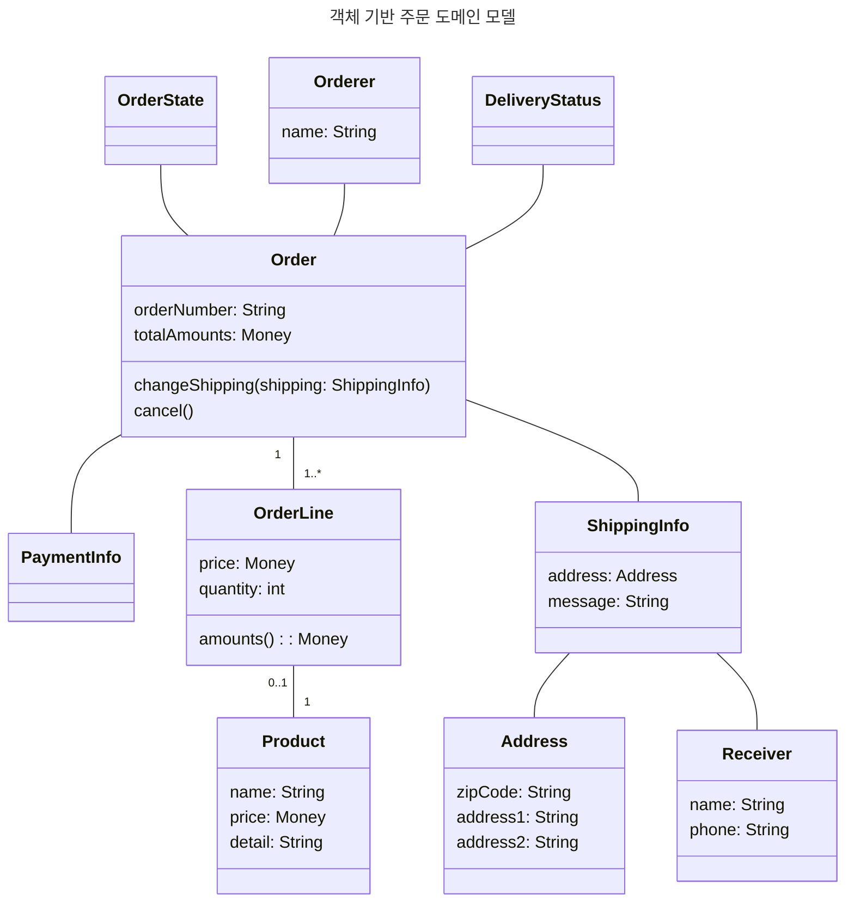

```mermaid
---
title: 객체 기반 주문 도메인 모델
---

classDiagram
	class OrderState
	class DeliveryStatus
	class PaymentInfo
	
	class Order {
		orderNumber: String
		totalAmounts: Money
		changeShipping(shipping: ShippingInfo)
		cancel()
	}
	
	class Orderer {
		name: String
	}

	class OrderLine {
		price: Money
		quantity: int
		amounts(): Money
	}

	class ShippingInfo {
		address: Address
		message: String
	}

	class Product {
		name: String
		price: Money
		detail: String
	}

	class Address {
		zipCode: String
		address1: String
		address2: String
	}

	class Receiver {
		name: String
		phone: String
	}

	OrderState -- Order
	Orderer -- Order
	DeliveryStatus -- Order
	Order "1" -- "1..*" OrderLine
	Order -- ShippingInfo
	Order -- PaymentInfo
	ShippingInfo -- Address
	ShippingInfo -- Receiver
	OrderLine "0..1" -- "1" Product
```