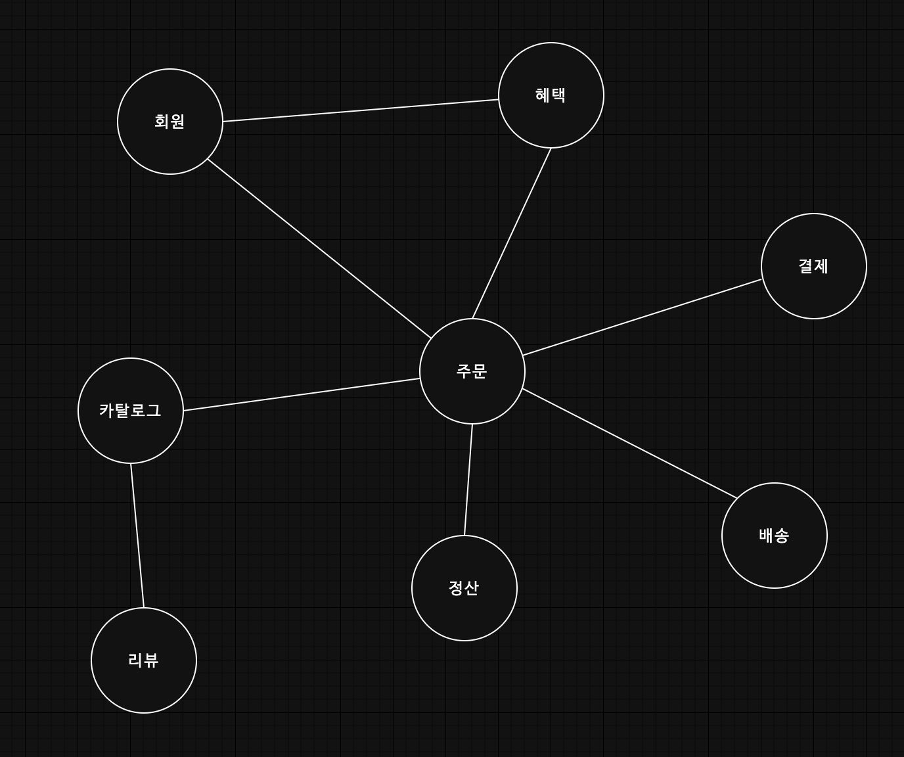
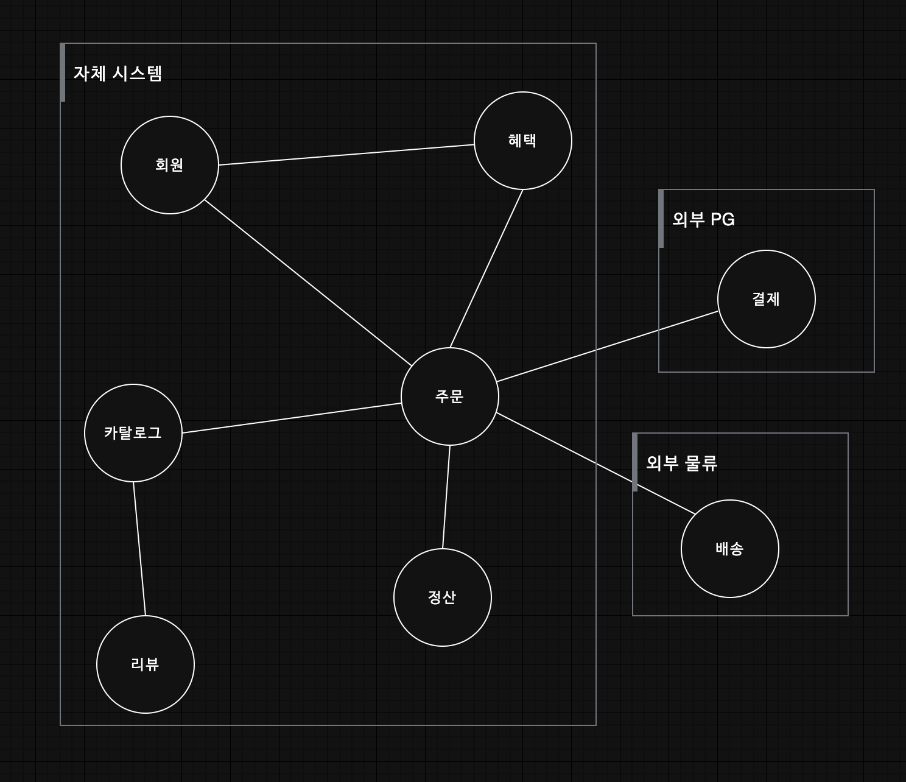
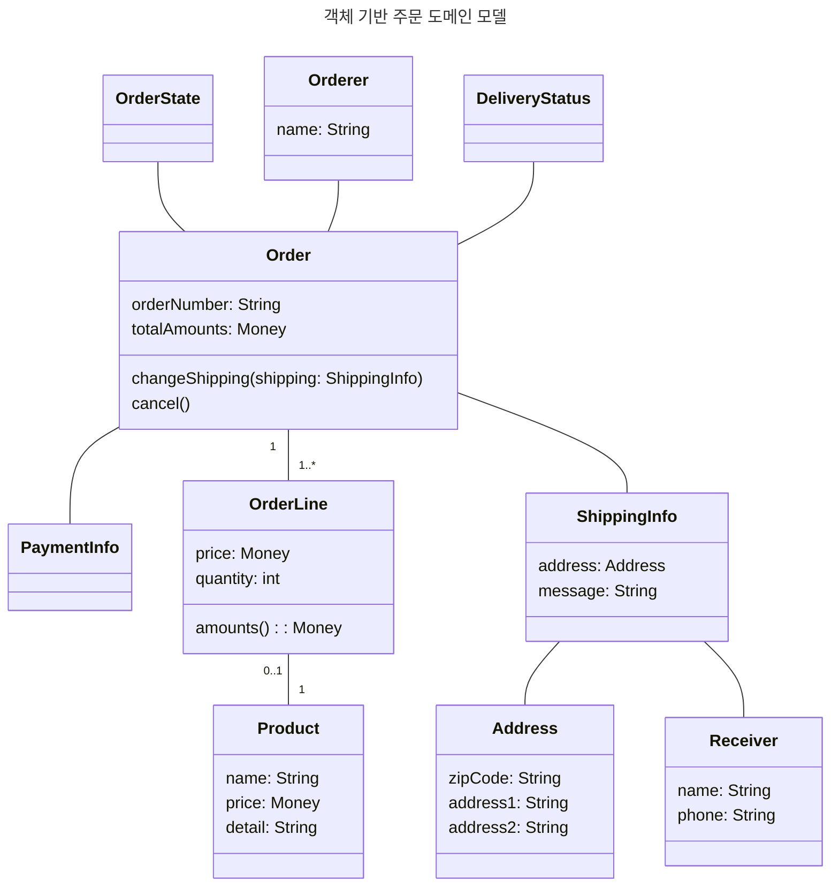
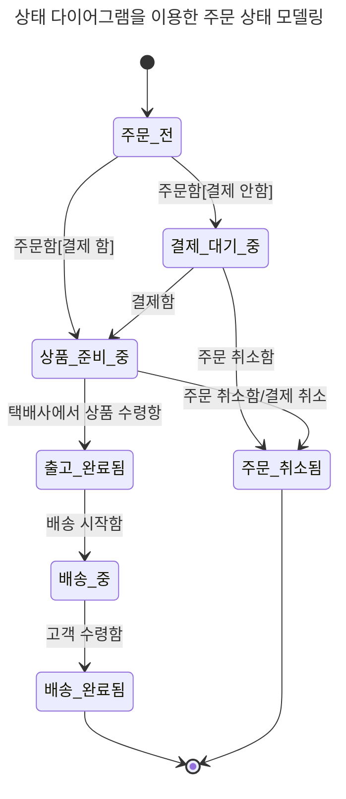
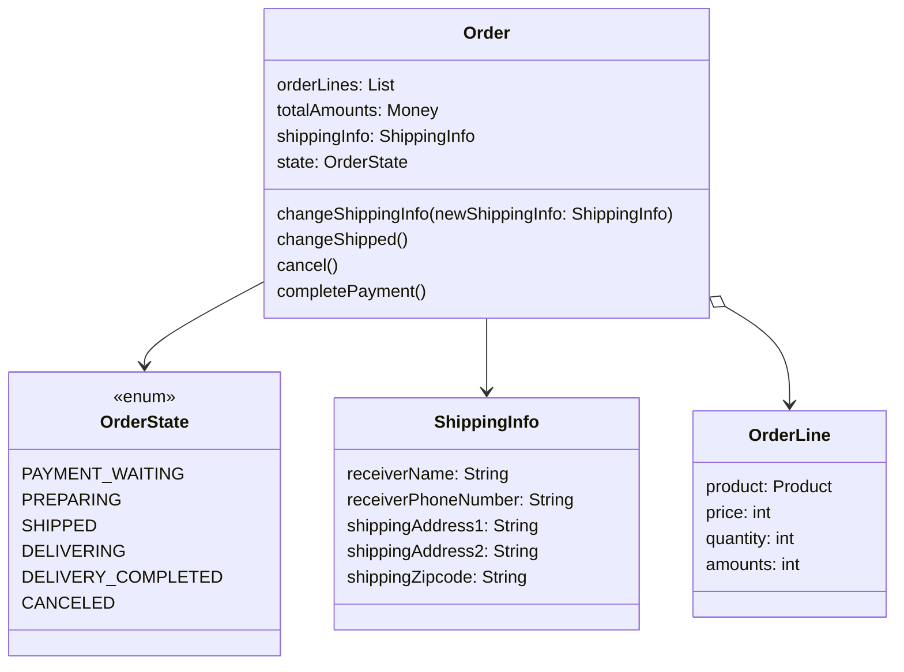
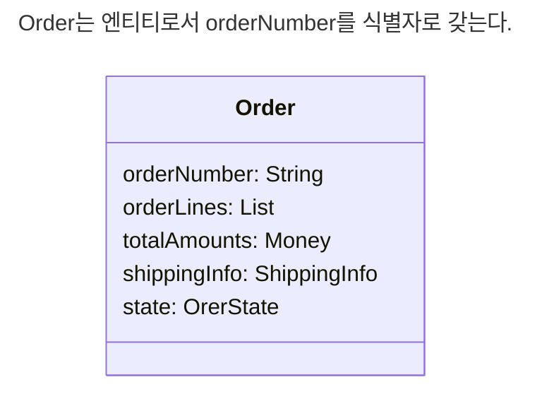

# 1.1 도메인이란?
온라인 서점 소프트웨어는 온라인으로 책을 판매하는 데 필요한 상품 조회, 구매, 결제, 배송 추적 등의 기능을 제공해야  한다.

소프트웨어로 해결하고자 하는 문제 영역을 도메인이라 한다.



1. 카탈로그 하위 도메인은 고객에게 구매할 수 있는 상품 목록을 제공한다.
2. 주문 하위 도메인은 고객의 주문을 처리한다.

한 하위 도메인은 다른 하위 도메인과 연동하여 완전한 기능을 제공한다.
예를들어 고객이 물건을 구매하면 주문, 결제, 배송, 혜택 하위 도메인의 기능이 엮이게 된다.


> [!note]
> 특정 도메인을 위한 소프트웨어라고 해서 도메인이 제공해야 할 모든 기능을 직접 구현하는 것은 아니다.
> 자체적으로 배송 시스템을 구축하기보단 외부 배송 업체의 시스템을 사용한다.



하위 도메인을 어떻게 구성할지 여부는 상황에 따라 달라진다.

---
# 1.2 도메인 전문가와 개발자 간 지식 공유
코딩에 앞서 요구사항을 올바르게 이해하는 것이 중요하다.
요구사항을 제대로 이해하지 않으면 쓸모없거나 유용함이 떨어지는 시스템을 만든다.

도메인 전문가 만큼은 아니겠지만 이해관계자와 개발자도 도메인 지식을 갖춰야 한다. 제품 개발과 관련된 도메인 전문가, 관계자, 개발자가 같은 지식을 공유하고 직접 소통할수록 도메인 전문가가 원하는 제품을 만들 가능성이 높아진다.

# 1.3 도메인 모델
기본적으로 도메인 모델은 특정 도메인을 개념적으로 표현한 것



도메인의 모든 내용을 담고 있지는 않지만 Order는 OrderNumber와 totalAmounts가 있고, ShippingInfo를 ChangeShipping 할 수 있음을 알 수 있다. 또한 주문을 cancel 할 수 있다.

> [!note]
> 도메인 모델을 사용하면 여러 관계자들이 동일한 모습으로 도메인을 이해하고
> 도메인 지식을 공유하는 데 도움이 된다.

도메인을 이해하려면 도메인이 제공하는 기능과 도메인의 주요 데이터 구성을 파악해야 하는데, 이런 면에서 기능과 데이터를 함께 보여주는 객체 모델은 도메인을 모델링하기에 적합하다.



관계가 중요한 도메인이라면 그래프를 이용해서 도메인을 모델링할 수 있다.
계산 규칙이 중요하다면 수학 공식을 활용해서 도메인 모델을 만들 수도 있다.

==도메인을 이해하는 데 도움이 된다면 표현 방식이 무엇인지는 중요하지 않다.==

객체 기반 모델을 기반으로 도메인을 표현했다면 객체 지향 언어를 이용해 개념 모델에 가깝게 구현할 수 있다.
비슷하게 수학적인 모델을 사용한다면 함수를 이용해서 도메인 모델과 유사한 구현 모델을 만들 수 있다.


# 1.4 도메인 모델 패턴

| 영역           | 설명                                                      |
| ------------ | ------------------------------------------------------- |
| Presentation | 사용자의 요청을 처리, 사용자에게 정보를 보여준다.                            |
| Application  | 사용자가 요청한 기능을 실행. 업무 로직을 직접 구현하지 않으며 도메인 계층을 조합해서 기능을 실행 |
| Domain       | 시스템이 제공할 도메인 규칙                                         |
| Infra        | DB나 메시징 시스템과 같은 외부 시스템과의 연동                             |
엔터프라이즈 애플리케이선 아키텍처 패턴 - 마틴 파울러

도메인 모델은 아키텍처 상의 도메인 계층을 객체 지향 기법으로 구현하는 패턴


#### 예시
```java
public class Order {  
    private OrderState state;  
    private ShippingInfo shippingInfo;  
      
    public void changeShippingInfo(ShippingInfo newShippingInfo) {  
        if (!state.isShippingChangeable()) {  
            throw new IllegalStateException("can't change shipping in {}" + state);  
        }  
          
        this.shippingInfo = newShippingInfo;  
    }  
}

public enum OrderState {  
    PAYMENT_WAITING {  
        public boolean isShippingChangeable() {  
            return true;  
        }  
    },  
    PREPARING {  
        public boolean isShippingChangeable() {  
            return true;  
        }  
    },  
    SHIPPED, DELIVERING, DELIVERY_COMPLETED;  
  
    public boolean isShippingChangeable() {  
        return false;  
    }  
}
```

OrderState는 주문 대기 중이거나 상품 준비 중에는 배송지를 변경할 수 있따는 도메인 규칙을 구현하고 있다.

실제 배송지 정보를 변경하는 Order 클래스의 changeShippingInfo() 메서드는 OrderState의 isShippingChangeable() 메서드를 이용해서 변경 가능한 경우에만 배송지를 변경한다.

큰 틀에서 보면 Order에서 판단할 수 있다.

배송지 변경이 가능한지를 판단할 규칙이 주문 상태와 다른 정보를 함께 사용한다면 OrderState만으로는 배송지 변경 가능 여부를 판단할 수 없다. 그러므로 Order에서 로직을 구현해야 한다.

```diff
public class Order {  
    private OrderState state;  
    private ShippingInfo shippingInfo;  
      
    public void changeShippingInfo(ShippingInfo newShippingInfo) {  
-        if (!state.isShippingChangeable()) {  
+		if (!isShippingChangeable()) {  
            throw new IllegalStateException("can't change shipping in {}" + state);  
        }  
          
        this.shippingInfo = newShippingInfo;  
    }

+	private boolean isShippingChangeable() {  
+	    return state == OrderState.PAYMENT_WAITING ||  
+	            state == OrderState.PREPARING;  
+	}
}

public enum OrderState {  
-    PAYMENT_WAITING {  
-        public boolean isShippingChangeable() {  
-            return true;  
-        }  
-    },  
-    PREPARING {  
-        public boolean isShippingChangeable() {  
-            return true;  
-        }  
-    },  
-    SHIPPED, DELIVERING, DELIVERY_COMPLETED;  
+	PAYMENT_WAITING, PREPARING, SHIPPED, DELIVERING, DELIVERY_COMPLETED;
-    public boolean isShippingChangeable() {  
-        return false;  
-    }  
}
```

> [!note]
> 중요한 점은 Order에 있든 OrderState에 있든 중요 업무 규칙을 주문 도메인 모델인 Order나 OrderState에서 구현한다는 점이다.
>
> 핵심 규칙을 구현한 코드는 도메인 모델에만 위치하기 때문에 규칙이 바뀌거나 규칙을 확장해야 할 때 다른 코드에 영향을 덜 주고 변경 내역을 모델에 반영할 수 있게 된다.

# 1.5 도메인 모델 도출
도메인에 대한 이해 없이 코딩을 시작할 수 없다. 기획서, 유스케이스 등 요구사항과 관련자와의 대화를 통해 도메인을 이해하고 이를 바탕으로 도메인 모델 초안을 만들어야 한다.

요구사항에
'출고 상태로 변경하기'
'배송지 정보 변경하기'
'주문 취소하기'
'결제 완료하기'
기능을 제공해야한다.
```diff
public class Order {  
    private OrderState state;  
    private ShippingInfo shippingInfo;  
  
    public Order(OrderState state, ShippingInfo shippingInfo) {  
        this.state = state;  
        this.shippingInfo = new ShippingInfo();  
    }  

	// 배송지 정보 변경하기
    public void changeShippingInfo(ShippingInfo newShippingInfo) {  
        if (!isShippingChangeable()) {  
            throw new IllegalStateException("can't change shipping in " + state);  
        }  
  
        this.shippingInfo = newShippingInfo;  
    }  
  
    private boolean isShippingChangeable() {  
        return state == OrderState.PAYMENT_WAITING ||  
                state == OrderState.PREPARING;  
    }  
      
+    public void changeShipped() {}  
+    public void cancel() {}  
+    public void completePayment() {}  
}
```

요구사항에 따르면 주문 항목을 표현하는 OrderLine은 적어도 주문할 상품, 상품 가격, 구매 개수를 포함해야 한다.
- 한 상품을 한 개 이상 주문할 수 있다.
- 각 상품의 구매 가격 합은 상품 가격에 구매 개수를 곱한 값이다.
```java
public class OrderLine {  
    private Product product;  
    private int price;  
    private int quantity;  
    private int amounts;  
      
    public OrderLine(Product product, int price, int quantity) {  
        this.product = product;  
        this.price = price;  
        this.quantity = quantity;  
        this.amounts = calculateAmounts();  
    }  
      
    private int calculateAmounts() {  
        return price * quantity;  
    }  
      
    public int getAmounts() {  
        return amounts;  
    }  
}
```

다음 요구사항은 Order와 OrderLine과의 관계를 알려준다.
- 최소 한 종류 이상의 상품을 주문해야 한다.
- 총 주문 금액은 각 상품의 구매 가격 합을 모두 더한 금액이다.

```diff
public class Order {  
+    private List<OrderLine> orderLines;  
+    private Money totalAmounts;  
      
    private OrderState state;  
    private ShippingInfo shippingInfo;  
      
+    public Order(List<OrderLine> orderLines) {  
+        setOrderLines(orderLines);  
+    }  
  
    public Order(OrderState state, ShippingInfo shippingInfo) {  
        this.state = state;  
        this.shippingInfo = new ShippingInfo();  
    }  
  
    public void changeShippingInfo(ShippingInfo newShippingInfo) {  
        if (!isShippingChangeable()) {  
            throw new IllegalStateException("can't change shipping in " + state);  
        }  
  
        this.shippingInfo = newShippingInfo;  
    }  
  
    private boolean isShippingChangeable() {  
        return state == OrderState.PAYMENT_WAITING ||  
                state == OrderState.PREPARING;  
    }  
  
    public void changeShipped() {}  
    public void cancel() {}  
    public void completePayment() {}  
      
+    private void setOrderLines(List<OrderLine> orderLines) {  
+        verifyAtLestOneOrMoreOrderLines(orderLines);  
+        this.orderLines = orderLines;  
+        calculateTotalAmounts();  
+    }  
      
+    private void verifyAtLestOneOrMoreOrderLines(List<OrderLine> orderLines) {  
+        if (orderLines == null || orderLines.isEmpty()) {  
+            throw new IllegalArgumentException("no OrderLine");  
+        }  
+    }  
      
+    private void calculateTotalAmounts() {  
+        int sum = orderLines.stream()  
+                .mapToInt(OrderLine::getAmounts)  
+                .sum();            
+        this.totalAmounts = new Money(sum);  
+    }  
}
```

배송지 정보는 이름, 전화번호, 주소 데이터를 가지므로 ShippingInfo 클래스를 정의할 수 있다.
```java
@Getter  
public class ShippingInfo {  
    private String receiverName;  
    private String receiverPhoneNumber;  
    private String shippingAddress1;  
    private String shippingAddress2;  
    private String shippingZipcode;  
  
    public ShippingInfo() {}  
}
```

Order를 생성할 때 OrderLine의 목록뿐만 아니라 ShippingInfo도 함께 전달
```diff
public class Order {  
    private List<OrderLine> orderLines;  
    private Money totalAmounts;  
  
    private OrderState state;  
    private ShippingInfo shippingInfo;  

-	public Order(List<OrderLine> orderLines) {
+    public Order(List<OrderLine> orderLines, ShippingInfo shippingInfo) {  
        setOrderLines(orderLines);  
+        setShippingInfo(shippingInfo);  
    }  
  
    public Order(OrderState state, ShippingInfo shippingInfo) {  
        this.state = state;  
        this.shippingInfo = new ShippingInfo();  
    }  
  
    public void changeShippingInfo(ShippingInfo newShippingInfo) {  
-        if (!isShippingChangeable()) {  
-            throw new IllegalStateException("can't change shipping in " + state);  
-        } 
+		verifyNotYetShipped();  
  
-        this.shippingInfo = newShippingInfo;  
+		setShippingInfo(newShippingInfo);
    }  
  
-    private boolean isShippingChangeable() {  
-        return state == OrderState.PAYMENT_WAITING ||  
-                state == OrderState.PREPARING;  
-    }  
  
    public void changeShipped() {}  
    public void cancel() {
+	    verifyNotYetShipped();  
+		this.state = OrderState.CANCELED;
    }  
    public void completePayment() {}  
  
    private void setOrderLines(List<OrderLine> orderLines) {  
        verifyAtLestOneOrMoreOrderLines(orderLines);  
        this.orderLines = orderLines;  
        calculateTotalAmounts();  
    }  
  
+    private void setShippingInfo(ShippingInfo shippingInfo) {  
+        if (shippingInfo == null) {  
+            throw new IllegalArgumentException("no ShippingInfo");  
+        }  
+        this.shippingInfo = shippingInfo;  
+    }  
  
    private void verifyAtLestOneOrMoreOrderLines(List<OrderLine> orderLines) {  
        if (orderLines == null || orderLines.isEmpty()) {  
            throw new IllegalArgumentException("no OrderLine");  
        }  
    }
    
+	private void verifyNotYetShipped() {  
+	    if (state != OrderState.PAYMENT_WAITING
+	    && state != OrderState.PREPARING) {  
+	        throw new IllegalStateException("already shipped");  
+	    }  
+	}
  
    private void calculateTotalAmounts() {  
        int sum = orderLines.stream()  
                .mapToInt(OrderLine::getAmounts)  
                .sum();  
        this.totalAmounts = new Money(sum);  
    }  
}
```

# 1.6 엔티티와 밸류


## 1.6.1 엔티티
엔티티의 가장 큰 특징은 식별자를 가진다는 것




엔티티를 구현한 클래스는 다음과 같이 식별자를 이용해서 equals()메서드와 hashCode() 메서드를 구현할 수 있다.

```diff
public class Order {  
    // ... 
  
+    private String orderNumber;  
  
+    @Override  
+    public boolean equals(Object obj) {  
+        if (this == obj) return true;  
+        if (obj == null) return false;  
+        if (obj.getClass() != this.getClass()) return false;  
  
+        Order other = (Order) obj;  
+        if (this.orderNumber == null) return false;  
          
+        return this.orderNumber.equals(other.orderNumber);  
+    }

+	@Override  
+	public int hashCode() {  
+	    final int prime = 31;  
+	    int result = 1;  
	      
+	    result = prime * result + ((this.orderNumber == null) ? 0 : this.orderNumber.hashCode());  
+	    return result;  
+	}
}
```

## 1.6.2 엔티티의 식별자 생성
생략

## 1.6.3 밸류 타입
벨류 타입은 개념적으로 완전한 하나를 표현할 때 사용한다.
```java
@Getter  
public class Receiver {  
    private String name;  
    private String phoneNumber;  
  
    public Receiver(String name, String phoneNumber) {  
        this.name = name;  
        this.phoneNumber = phoneNumber;  
    }  
}
```

Receiver는 '받는 사람'이라는 도메인 개념을 표현한다. ShippingInfo의 receiverName과 receiverPhoneNumber 필드가 받는 사람과 관련된 데이터라는 것을 유추한다면 Receiver는 그 자체로 받는 사람을 뜻한다.

```diff
@Getter  
public class ShippingInfo {  
-    private String receiverName;  
-    private String receiverPhoneNumber;  
+	private Receiver receiver
    private String shippingAddress1;  
    private String shippingAddress2;  
    private String shippingZipcode;  
  
    public ShippingInfo() {}  
}
```

벨류 탕비이 꼭 두 개 이상의 데이터를 가져야 하는 것은 아니다.
돈을 의미하는 Money 타입을 만들어 사용하면 코드를 이해하는 데 도움이 된다.

```java
@Getter  
public class Money {  
    private int value;  
  
    public Money(int value) {  
        this.value = value;  
    }  
  
    public Money add(Money money) {  
        return new Money(this.value + money.value);  
    }  
  
    public Money multiply(int multiplier) {  
        return new Money(this.value * multiplier);  
    }  
}
```

```diff
public class OrderLine {  
    private Product product;  
-    private int price;
+    private Money price;  
    private int quantity;  
-    private int amounts;
+    private Money amounts;  

-	public OrderLine(Product product, int price, int quantity) {
+    public OrderLine(Product product, Money price, int quantity) {  
        this.product = product;
-        this.price = price;
+        this.price = new Money(price.getValue());  
        this.quantity = quantity;  
        this.amounts = calculateAmounts();  
    }  
  
    private Money calculateAmounts() {
-	    return price * quantity;  
+        return price.multiply(quantity);  
    }  
  
    public int getAmounts() {
-	    return amounts; 
+        return amounts.getValue();  
    }  
}
```

> [!note]
> Money가 불변 객체가 아니기 때문에 price가 변경될 때 발생하는 문제를 방지하기 위해 데이터를 복사한 새로운 객체를 생성

## 1.6.4 엔티티 식별자와 밸류 타입
String type의 id를 사용하면 일므만으로 해당 필드가 주문번호인지 알 수 없다.

OrderNo 타입을 만들면 타입 자체로 주문번호라는 것을 알 수 있으므로 필드 이름이 'id'여도 실제 의미를 찾는 것은 어렵지 않다.
```diff
  
public class Order {  
+    private OrderNo id;  

	// ..
      
+    public OrderNo getId() {  
+        return this.id;  
+    }
}
```

## 1.6.5 도메인 모델에 set 메서드 넣지 않기
get/set 메서드를 습관적으로 추가할 때가 있다.
```java
@Getter  
@Setter  
@NoArgsConstructor  
public class UserInfo {  
    private String id;  
    private String name;  
}
```

도메인 모델에 get/set을 무조건 추가하는 것은 좋지 않은 버릇이다. 특히 set 메서드는 모델의 핵심 개념이나 의도를 코드에서 사라지게 한다.

습관적인 set 메서드는 필드값만 변경하고 끝나기 때문에 상태 변경과 관련된 도메인 지식이 코드에서 사라지게 된다.
```diff
public class Order {
-	public void setShippingInfo(ShippingInfo newShippingInfo) { ... }    
+    public void changeShippingInfo(ShippingInfo newShippingInfo) { ... }    

-    public void setOrderState() { ... }
+    public void completePayment() { ... }
}
```

set 메서드의 또 다른 문제는 도메인 객체를 생성할 때 온전하지 않은 상태가 될 수 있다.
```java
Order order = new Order();

order.setOrderLine(lines);
order.setShippingInfo(shippingInfo);

// Orderer(주문자)를 설정하지 않은 상태에서 주문 완료 처리
order.setState(OrderState.PREPARING);
```

위 코드는 주문자 설정을 누락하고 있다.orderer가 null인 상황에서 order.setState()를 호출해서 상품 준비 중 상태로 바꾼 것이다.

orderer가 null인지 확인하는 코드를 setState()에 위치하는 것도 맞지 않다.

죽, 생성자를 통해 필요한 데이터를 모두 받아야 한다.

생성자로 필요한 것을 모두 받으므로 다음처럼 생성자를 호출하는 시점에 필요한 데이터가 올바른지 검사할 수 있다.
```java
public class Order {  
	// ...
  
    public Order(List<OrderLine> orderLines, ShippingInfo shippingInfo) {  
        setOrderLines(orderLines);  
        setShippingInfo(shippingInfo);  
    }  
  
    // ...
  
    private void setOrderLines(List<OrderLine> orderLines) {  
        verifyAtLestOneOrMoreOrderLines(orderLines);  
        this.orderLines = orderLines;  
        calculateTotalAmounts();  
    }  
  
    private void setShippingInfo(ShippingInfo shippingInfo) {  
        if (shippingInfo == null) {  
            throw new IllegalArgumentException("no ShippingInfo");  
        }  
        this.shippingInfo = shippingInfo;  
    }  

	// ...
}
```

여기에서 set 메서드는 private으로 선언하였다. 외부에서 데이터 변경을 목적으로 set 메서드를 사용할 수 없다.

# 1.7 도메인 용어와 유비쿼터스 언어
코드를 작성할 때 도메인에서 사용하는 용어는 매우 중요하다.

```java
public enum OrderState {
	STEP1, STEP2, STEP3, STEP4, STEP5, STEP6
}

public class Order {
	public void changeShippingInfo(ShippingIndo newShippingInfo) {
		verifyStep1OrStep2();
		setShippingInfo(newShippingInfo);
	}
	private void verifyStep1OrStep2() {
		if (state != OrderState.STEP1 && state != OrderState.STEP2)
			throw new IllegalStateException("already shipped");
	}
}
```

배송지 변경은 '출고 전'에 가능한데 이 코드의 verifyStep1OrStep2는 중요한 도메인 규칙이 들어나지 않는다.

```diff
public enum OrderState {
-	STEP1, STEP2, STEP3, STEP4, STEP5, STEP6
+	PAYMENT_WAITING, PREPARING, SHIPPED, DELIVERING, DELIVERY_COMPLETED;
}
```

코드를 도메인 용어로 해석하거나 도메인 용어를 코드로 해석하는 과정이 줄어든다. 이는 코드의 가독성을 높여서 코드를 분석하고 이해하는 시간을 줄여준다.

최대한 도메인 용어를 사용해서 도메인 규칙을 코드로 작성하게 되므로 의미를 변환하는 과정에서 발생하는 버그도 줄어든다.