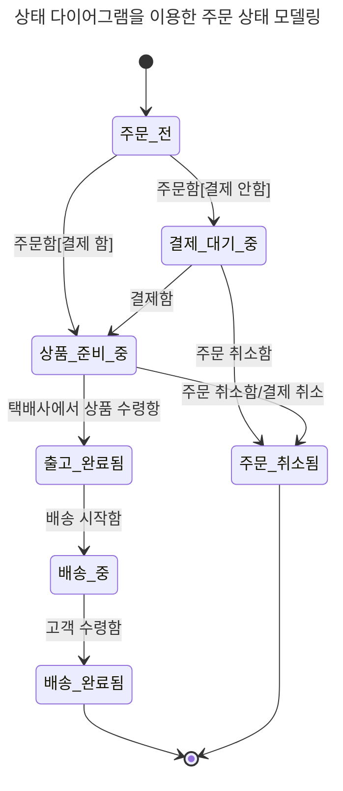

```mermaid
---
title: 상태 다이어그램을 이용한 주문 상태 모델링
---
stateDiagram-v2 
	[*] --> 주문_전
	주문_전 --> 결제_대기_중: 주문함[결제 안함]
	주문_전 --> 상품_준비_중: 주문함[결제 함]
	결제_대기_중 --> 상품_준비_중: 결제함
	결제_대기_중 --> 주문_취소됨: 주문 취소함
	상품_준비_중 --> 출고_완료됨: 택배사에서 상품 수령항
	상품_준비_중 --> 주문_취소됨: 주문 취소함/결제 취소
	출고_완료됨 --> 배송_중: 배송 시작함
	배송_중 --> 배송_완료됨: 고객 수령함
	배송_완료됨 --> [*]
	주문_취소됨 --> [*]
```