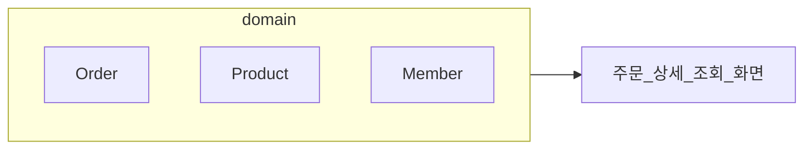
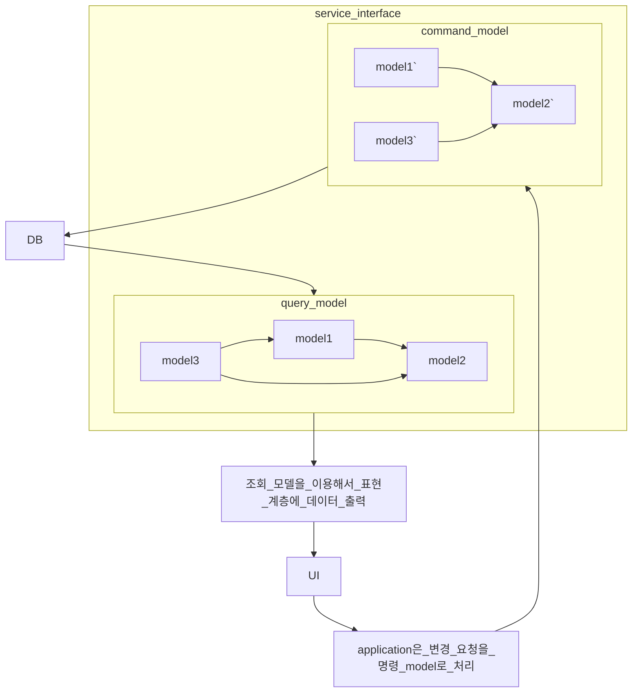
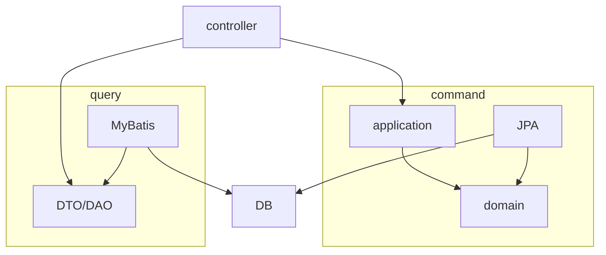
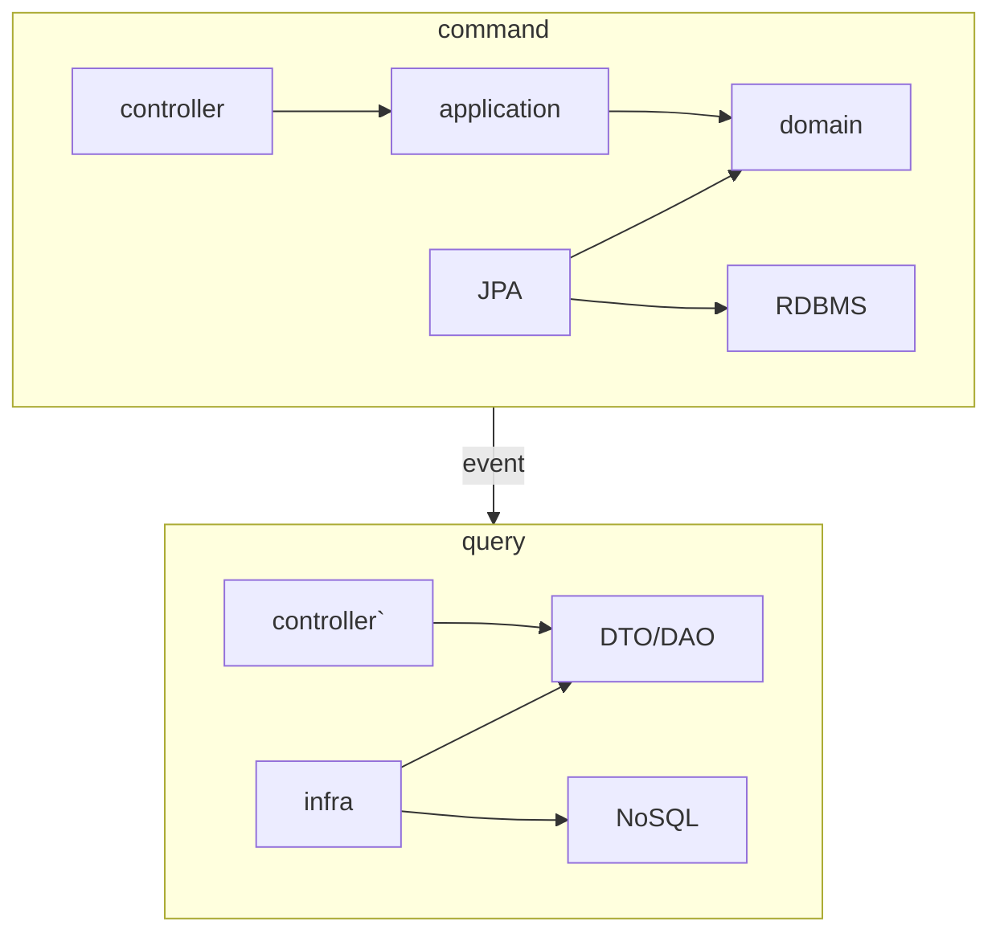

# chapter11 CQRS


## 11.1 단일 모델의 단점
주문 내역 조회 기능을 구현하려면 여러 aggregate에서 데이터를 가져와야 한다.



조회 화면 특성상 조회 속도가 빠를수록 좋은데 여러 aggregate의 데이터가 필요하면 구현 방법을 고민해야 한다.

즉시 로딩 방식과 같은 JPA의 쿼리 관련 최적화 기능을 사용할 수 없다. 한번의 select 쿼리로 조회 화면에 필요한 데이터를 읽어올 수 없어 조회 성능에 문제가 생길 수 있다.

이런 고민이 발생하는 이유는 system 상태를 변경할 때와 조회할 때 단일 domain model을 사용하기 때문이다.

객체 지향으로 domain model을 구현할 때 주로 사용하는 ORM 기법은 domain 상태 변경 기능을 구현하는 데 적합하지만 주문 상세 조회 화면처럼 여러 aggregate에서 데이터를 가져와 출력하는 기능을 구현하기에는 고려할 게 많다.

## 11.2 CQRS
system이 제공하는 기능은 크게 두 가지로 나눌 수 있다.
1. 상태를 변경하는 기능
    1. 새로운 주문 생성
    2. 배송지 정보 변경
    3. 회원 암호를 변경
2. 사용자 입장에서 상태 정보를 조회
    1. 주문 상세 내역 보기
    2. 게시글 목록 보기
    3. 회원 정보 보기
    4. 판매 통계 보기

domain model 관점에서 상태 변경 기능은 주로 한 aggregate의 상태를 변경한다.

예) 주문 취소 기능과 배송지 정보 변경 기능은 한 개의 Order aggregate를 변경한다.
반면, 조회 기능에 필요한 데이터를 표시하려면 두 개 이상의 aggregate가 필요할 때가 많다.

**상태를 변경하는 범위와 상태를 조회하는 범위가 정확하게 일치하지 않기 때문**에 단일 model로 **두 종류의 기능을 구현하면 model이 불필요하게 복잡해진다.**




CQRS는 복잡한 domain에 적합하다. domain이 복잡할수록 명령 기능과 조회 기능이 다루는 데이터 범위에 차이가 난다.

CQRS를 사용하면 각 모델에 맞는 구현 기술을 선택할 수 있다.
1. command model은 객체 지향에 기반해서 domain model을 구현하기에 적당한 JPA를 사용한다.
2. query model은 DB 테이블에서 SQL로 데이터를 조회할 때 좋은 mybatis를 사용해서 구현하면 된다.



단순히 데이터를 읽어와 조회하는 기능은 application이 복잡하지 않기 때문에 controller에서 바로 DAO를 실행해도 무방하다. 물론 데이터를 presentation 영역에 전달하는 과정에서 몇 가지 로직이 필요하면 application을 두고 로직을 구현하면 된다.

```mermaid
classDiagram
	class Order {
		-number: OrderNo
		0totalAmounts:Money
	}

	class Orderer {
		-memberId: MemberId
		-name: String
	}

	class ShippingInfo {
		-address: Address
		-message: String
	}

	class OrderLine {
		-productId: ProductId
		-price: Money
		-quantity: int
		-amounts: Money
	}

	class Product {
		-id: ProductId
		-name: String
		-price: Money
		-detail: String
	}

	class Receiver {
		-name: String
		-phone: String
	}

	class OrderSummary {
		-member: String
		-version: long
		-ordererId: String
		-ordererName: String
		-totalAmounts: int
		-receiverName: String
		-state: String
		-orderDate: Date
		-productId: String
		-productName: String
	}

	Order --> Orderer: 
	Order --> ShippingInfo: 
	ShippingInfo --> Receiver
	OrderLine <--o Order: 
	
```

command model과 query model은 서로 다른 데이터 저장소를 사용할 수도 있다. command model은 Transaction을 지원하는 RDBMS를 사용하고, query model은 조회 성능이 좋은 메모리 기반 NoSQL을 사용할 수 있다.



command model과 query model이 서로 다른 데이터 저장소를 사용할 경우 데이터 동기화 시점에 따라 구현 방식이 달라질 수 있다. command model에서 데이터가 바꾸자마자 변경 내역을 바로 query model에 반영해야 한다면 동기 event와 global transaction을 사용해서 실시간으로 동기화할 수 있다.

서로 다른 저장소의 데이터를 특정 시간 안에만 동기화해도 된다면 비동기로 데이터를 전송하면 된다.

#### 11.2.1 웹과 CQRS
포털이나 대형 온라인 쇼핑몰과 같이 조회 기능 요청 비율이 월등히 높은 service를 만드는 개발팀은 조회 성능을 높이기 위해 다양한 기법을 사용한다.
1. query를 최적화해서 실행 속도를 높인다.
2. memory에 조회 데이터를 cache 해서 응답 속도를 높인다.
3. 조회 전용 저장소를 따로 사용한다.

memory에 cache 하는 데이터는 DB에 보관된 데이터를 그대로 저장하기보다는 화면에 맞는 모양으로 변환한 데이터를 cache 할 때 성능에 더 유리하다.

#### 11.2.2 CQRS 장단점
장점
1. command model을 구현할 때 domain 자체에 집중할 수 있다.
2. command model에서 조회 관련 로직이 사라져 복잡도가 낮아진다.
3. 조회 성능을 향상시키는 데 유리하다.
    1. 조회 단위로 cache 기술을 적용할 수 있다.
    2. 조회에 특화된 query를 사용할 수 있다.
    3. 조회 전용 저장소를 사용하면 조회 처리량을 대폭 늘릴 수 있다.

단점
1. 구현해야 할 코드가 더 많아진다.
    1. domain이 단순하거나 트래픽이 많지 않은 service라면 조회 전용 model을 따로 만들 때 얻을 이점이 있는지 따져봐야 한다.
2. 더 많은 구현 기술이 필요하다
    1. command model과 query model을 다른 구현 기술을 사용해서 구현하기도 한다.
    2. 다른 저장소를 사용하기도 한다.
    3. data sync를 위해 messaging system을 도입해야 할 수도 있다.