# 2.1 네 개의 영역
> [!note]
> 도메인과 관련없는 내용은 생락하였음


응용 영역은 기능을 구현하는 위해 도메인 영역의 도메인 모델을 사용한다.

```java
@Transactional  
public class CancelOrderService {  
      
    public void cancelOrder(String orderId) {  
        Order order = findOrderById(orderId);  
          
        if (order == null) throw new OrderNotFoundException();  
          
        order.cancel();  
    }
}
```

응용 서비스는 로직을 직접 수행하기보다는 도메인 모델에 로직 수행을 위함한다.

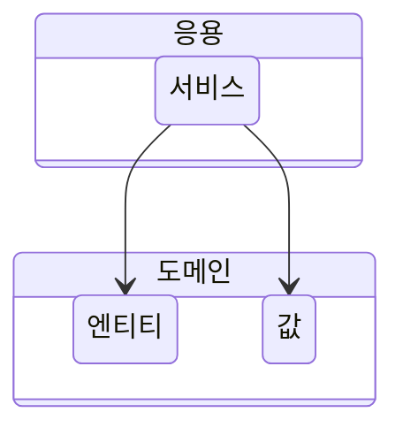

예를 들어 주문 도메인은 '배송지 변경', '결제 완료', '주문 총액 계산'과 같은 핵심 로직을 도메인 모델에서 구현한다.

# 2.2 계층 구조 아키텍처

```java
public class DroolsRuleEngine {  
    private KieContainer kContainer;  
  
    public DroolsRuleEngine(KieContainer kContainer) {  
        KieServices ks = KieServices.Factory.get();  
        kContainer = ks.getKieClasspathContainer();  
    }  
      
    public void evalute(String sessionName, List<?> facts) {  
        KieSession kSession = kContainer.newKieSession(sessionName);  
          
        try {  
            facts.forEach(kSession::insert);  
            kSession.fireAllRules();  
        } finally {  
            kSession.dispose();  
        }  
    }  
}
```

응용 영역은 가격 계싼을 위해 인프라스트럭처 영역의 DroolsRuleEngine을 사용
```java
public class CalculateDiscountService {  
    private DroolsRuleEngine ruleEngine;  
  
    public CalculateDiscountService(DroolsRuleEngine ruleEngine) {  
        this.ruleEngine = new DroolsRuleEngine();  
    }  
  
    public Money calculateDiscount(List<OrderLine> orderLines, String customerId) {  
        Customer customer = findCustomer(customerId);  
  
        MutableMoney money = new MutableMoney(0);  
        List<Object> facts = Arrays.asList(customer, money);  
  
        facts.addAll(orderLines);  
        ruleEngine.evalute("discountCalculation", facts);  
        return money.toImmutableMoney();  
    }  
  
    // ...
  
}
```

코드만 보면 Drools가 제공하는 타입을 직접 사용하지 않으므로 CalculateDiscountService가 Drools 자체에 의존하지 않는다고 생각할 수 있다. 하지만 'discountCalculation' 문자열은 Drools의 세션 이름을 의미한다. 따라서 Drools의 세션 이름을 변경하면 CalculateDiscountService의 코드도 함께 변경해야 한다.

이처럼 CalculateDiscountService가 겉으로는 인프라스트럭처의 기술에 직접적인 의존을 하지 않는 것처럼 보여도 실제로는 Drools라는 인프라스트럭처 영역의 기술에 완전하게 의존하고 있다.

인프라스트럭처에 의존하면 '테스트 어려움'과 '기능 확장의 어려움'이라는 두 가지 문제가 발생한다.

# 2.3 DIP
가격 할인 계산을 하려면 고객 정보를 구해야 하고, 구한 고객 정보와 주문 정보를 이용해서 룰을 실행해야 한다.

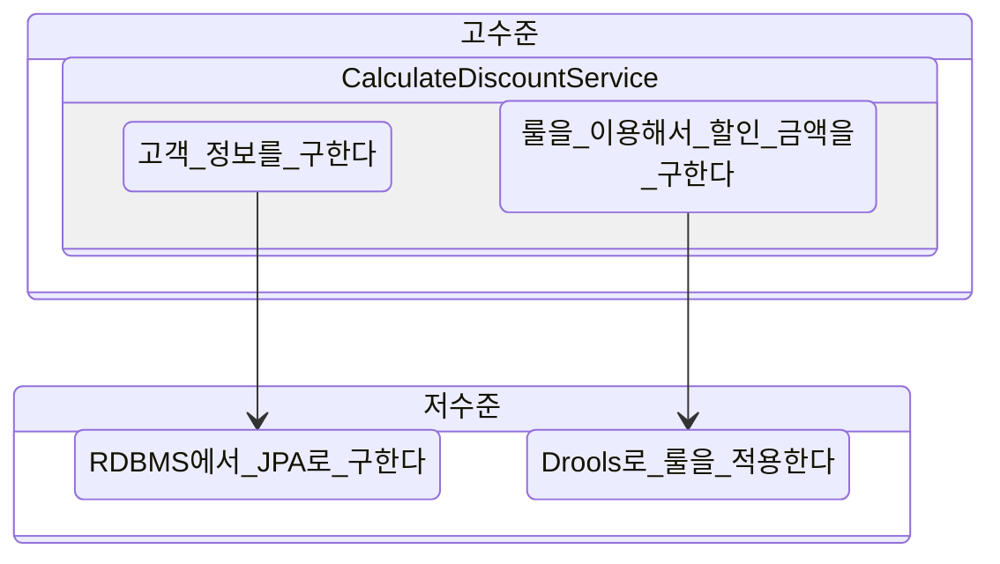


고수준 모듈이 제대로 동작하려면 저수준 모듈을 사용해야 한다. 그런데 고수준 모듈이 저수준 모듈을 사용하면 앞서 계층 구조 아키텍처에서 언급했던 두 가지 문제 즉, 구현 변경과 테스트가 어렵다는 문제가 발생한다.

**CalculateDiscountService 입장**에서 봤을 때 룰 적용을 **Drools로 구현**했는지 **자바로 직접 구현**했는지는 **중요하지 않다.** '고객 정보와 구매 정보에 룰을 적용해서 할인 금액을 구한다'라는 것만 중요하다.

이를 추상화한 인터페이스는 다음과 같다.

```java
public interface RuleDiscounter {  
    Money applyRules(Customer customer, List<OrderLine> orderLines);  
}
```

```diff
public class CalculateDiscountService {
-	private DroolsRuleEngine ruleEngine;
+    private RuleDiscounter ruleDiscounter;  

-	public CalculateDiscountService() {
+    public CalculateDiscountService(RuleDiscounter ruleDiscounter) {  
-        this.ruleEngine = new DroolsRuleEngine();
+        this.ruleDiscounter = ruleDiscounter;  
    }  
  
    public Money calculateDiscount(List<OrderLine> orderLines, String customerId) {  
        Customer customer = findCustomer(customerId);
	    
-	    MutableMoney money = new MutableMoney(0);  
-		List<Object> facts = Arrays.asList(customer, money);  
  
-		facts.addAll(orderLines);  
-		ruleEngine.evalute("discountCalculation", facts);  
		
-		return money.toImmutableMoney();
+        return ruleDiscounter.applyRules(customer, orderLines);  
    }

	// ...
}
```

CalculateDiscountService에는 Drools에 의존하는 코드가 없다. 단지 RuleDiscounter가 룰을 적용한다는 사실만 안다.

룰 적용을 구현한 클래스는 RuleDiscounter 인터페이스를 상속받아 구현한다. 다시 말하면 Drools 관련 코드를 이해할 필요는 없다.

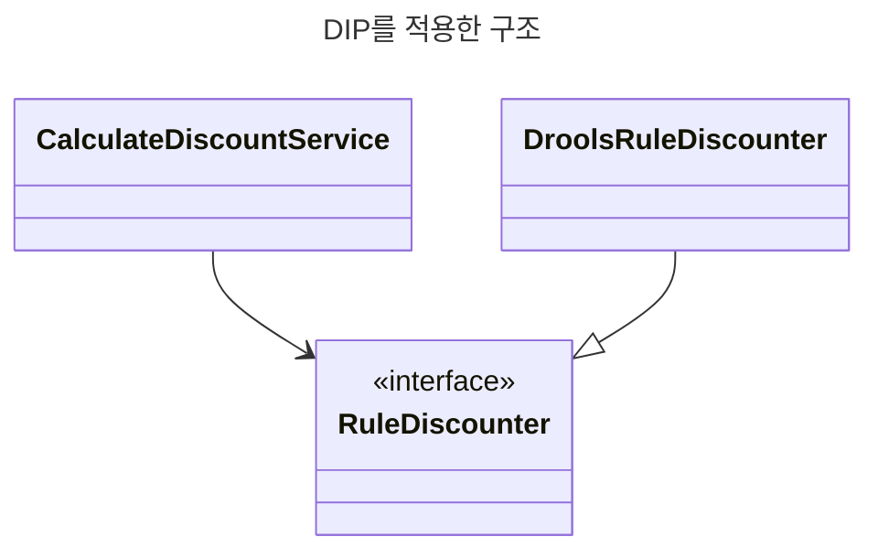

저수준 모듈이 고수준 모듈에 의존한다고 해서 DIP (의존 역전 원칙)라고 부른다.

DIP를 적용하면 앞의 다른 영역이 인프라스트럭처 영역에 의존할 때 발생했던 두 가지 문제인 구현 교체가 어렵다는 것과 테스트가 어려운 문제를 해소할 수 있다.

```java
public class CalculateDiscountService {  
    private CustomerRepository customerRepository;  
    private RuleDiscounter ruleDiscounter;  
  
    public CalculateDiscountService(CustomerRepository customerRepository, RuleDiscounter ruleDiscounter) {  
        this.customerRepository = customerRepository;  
        this.ruleDiscounter = ruleDiscounter;  
    }  
  
    public Money calculateDiscount(List<OrderLine> orderLines, String customerId) {  
        Customer customer = findCustomer(customerId);  
  
        return ruleDiscounter.applyRules(customer, orderLines);  
    }  
  
    private Customer findCustomer(String customerId) {  
        Customer customer = customerRepository.findById(customerId);  
  
        if (customer == null) throw new NoCustomerException();  
  
        return customer;  
    }  
  
}
```

CalculateDiscountService가 제대로 동작하는지 테스트하려면 CustomerRepository와 RuleDiscounter를 구현한 객체가 필요하다. 다음은 대역 객체를 사용해서 Customer가 존재하지 않는 경우 익셉션이 발생하는지 검증하는 테스트 코드의 예시다.

```java
@Test  
public void noCustomer_thenExceptionShouldBeThrown() {  
    // 테스트 목적의 대역 객체  
    CustomerRepository stubRepo = mock(CustomerRepository.class);  
    when(stubRepo.findById("noCustId")).thenReturn(null);  
  
    RuleDiscounter stubRule = (cust, lines) -> null;  
  
    // 대용 객체를 주입 받아 테스트 진행  
    CalculateDiscountService calDisSvc = new CalculateDiscountService(stubRepo, stubRule);  
  
    assertThrows(NoCustomerException.class,  
            () -> calDisSvc.calculateDiscount(List.of(), "noCustId"));  
}
```

이렇게 실제 구현 없이 테스트를 할 수 있는 이유는 DIP를 적용해서 고수준 모듈이 저수준 모듈에 의존하지 않도록 했기 때문이다.

## 2.3.1 DIP 주의사항
DIP를 잘못 생각하면 단순히 인터페이스와 구현 클래스를 분리하는 정도로 받아들일 수 있다.
DIP를 적용한 결과 구조만 보고 저수준 모듈에서 인터페이스를 추출하는 경우가 있다.

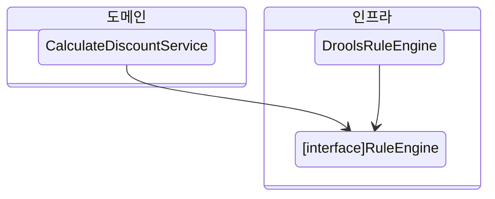

RuleEngine 인터페이스는 **고수준 모듈인 도메인 관점이 아니라** 룰 엔진이라는 **저수준 모듈 관점에서 도출**한 것이다.

==규칙에 따라 할인 금액을 계산한다는 것이 중요하다.==

즉, **'할인 금액 계산'을 추상화한 인터페이스**는 저수준 모듈이 아닌 **고수준 모듈**에 위치한다.

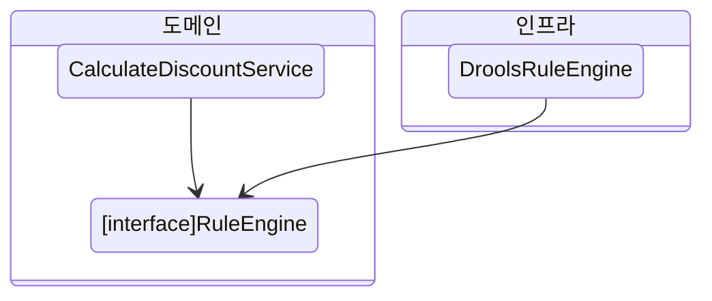

## 2.3.2 DIP와 아키텍처
infrastructure는 저수준 모듈이고 applictaion과 domain은 고수준 모듈이다.
계층형 구조와 달리 아키텍처에 DIP를 적용하면 infrastructure 영역이 application과 domain 영역에 의존하는 구조가 된다.

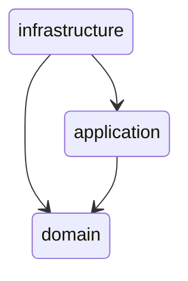

# 2.4 도메인 영역의 주요 구성 요소
도메인 영역의 주요 구성요소

| 요소             | 설명                                                                                                                                                              |
| -------------- | --------------------------------------------------------------------------------------------------------------------------------------------------------------- |
| entity         | 고유의 식별자를 갖는 객체로 자신의 라이프 사이클을 갖는다.. 도메인 모델의 데이털르 포함하며 해당 데이터와 관련된 기능을 함께 제공한다.                                                                                   |
| value          | 고유 식별자를 갖지 않는 객체로 주로 개념적으로 하나의 값을 표현할 때 사용. Address나 Money와 같은 타입이 밸류 타입                                                                                        |
| aggregate      | aggregate는 연관된 entity와 value 객체를 개념적으로 하나로 묶은 것. 예를들어 주문과 관련된 Order entity, OrderLine value, Orderer value 객체를 '주문' aggreate로 묶을 수 있다.                          |
| repository     | domain의 영속성을 처리한다.                                                                                                                                              |
| domain service | 특정 entity에 속하지 않은 domain 로직을 제공한다. '할인 금액 계산'은 상품, 쿠폰, 회원 등급, 구매 금액 등 다양한 조건을 이용해서 구현하게 되는데, 이렇게 domain 로직이 여러 entity와 value를 필요로 하면 domain service에서 로직을 구현한다. |

## 2.4.1 엔티티와 벨류
실제 도메인 모델의 엔티티와 DB 관계형 모델의 엔티티는 같은 것이 아니다.

이 두 모델의 가장 큰 차이점은 도메인 모델의 엔티티느 데이터와 함께 도메인 기능을 제공한다는 점이다.
예를들어 주문을 표현하는 엔티티는 주문과 관련된 데이터뿐만 아니라 배송지 주소 변경을 위한 기능을 함께 제공한다.

```java
public class Order {
    // 주문 도메인 모델의 데이터
    private OrderNo number;
    private Orderer orderer;
    private ShippingInfo shippingInfo;

    // 도메인 모델 엔티티는 도메인 기능도 함께 제공
    public void changeShippingInfo(ShippingInfo newShippingInfo) {
    	// ...
    }
}
```

도메인 관점에서 기능을 구현하고 기능 구현을 캡슐화해서 데이터가 임의로 변경되는 것을 막는다.

또 다른 차이점은 도메인 모델의 엔티티는 <u>두 개 이상의 데이터가 개념적으로 하나인 경우 벨류 타입을 이용해서 표현할 수 있다</u>는 것이다.

벨류는 불변으로 구현하는 것을 권장한다. 엔티티의 벨류 타입 데이터를 변경할 때는 객체 자체를 완전히 교체하는 것을 의미한다.

```java
public class Order {  
    private ShippingInfo shippingInfo;  
  
    // ...  
  
    private void setShippingInfo(ShippingInfo shippingInfo) {  
        if (shippingInfo == null) {  
            throw new IllegalArgumentException("no ShippingInfo");  
        }  
	    
        // 벨류 타입의 데이터를 변경할 때는 새로운 객체로 교체
        this.shippingInfo = shippingInfo;  
    }
}
```

## 2.4.2 애그리거트
도메인이 커질수록 개발할 도메인 모델도 커지면서 많은 엔티티와 벨류가 생긴다.

도메인 모델이 복잡해지면 전체 구조가 아닌 한 개 엔티티와 벨류에만 집중하는 상황이 발생한다.

**도메인 모델**은 개별 객체뿐만 아니라 **상위 수준에서 모델을 볼 수 있어야** 전체 모델의 관계와 개별 모델을 이해하는 데 도움이 된다. 도메인 모델에서 **전체 구조를 이해**하는 데 도움이 되는 것이 바로 **에그리거트(aggregate)**다.

에그리거트는 군집에 속한 객체를 관리하는 루트 엔티티를 갖는다. 루트 엔티티는 에그리거트에 속해 있는 엔티티와 벨류 객체를 이용해서 에그리거트가 구현해야 할 기능을 제공한다.

에그리거트를 사용하는 코드는 에그리커드 루트가 제공하는 기능을 실행하고 에그리거트 루트를 통해서 간접적으로 에그리거트 내의 다른 엔티티나 벨류 객체에 접근한다. 이것은 에그리거트의 내부 구현을 숨겨서 에그리거트 단위로 구현을 캡슐화할 수 있도록 돕는다.

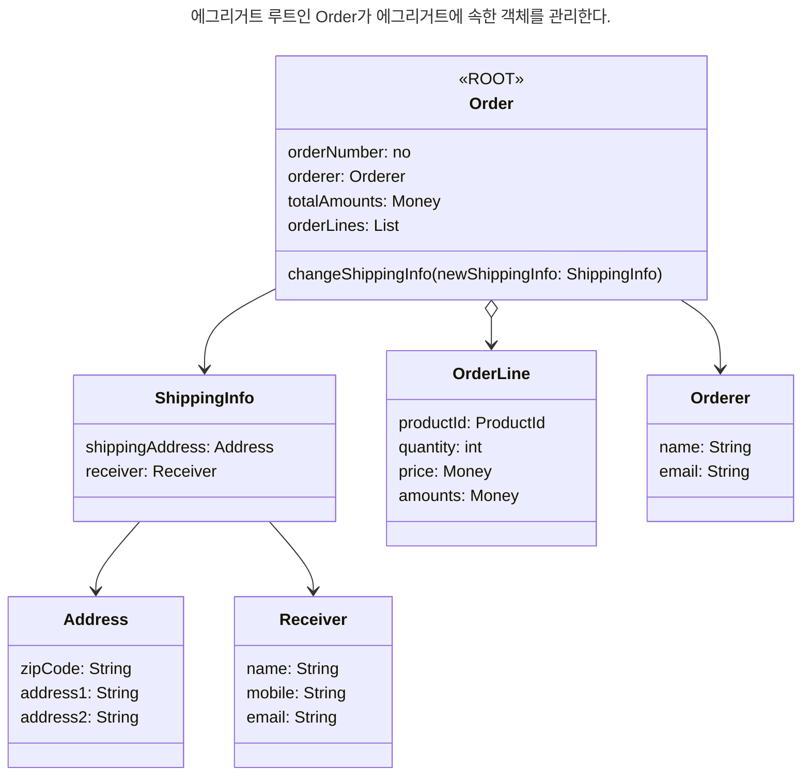

```java
public class Order {  

	// ...
  
    public void changeShippingInfo(ShippingInfo newInfo) {  
        
        this.shippingInfo = newInfo;
    }
    
    private void checkShippingInfoChangeable() {
        // ... 배송지 정보를 변경할 수 있는지 여부를 확인하는 도메인 규칙 구현
    }
```

주문 에그리거트는 Order를 통하지 않고 ShippingInfo를 변경할 수 있는 방법을 제공하지 않는다.

에그리거트를 구현할 때는 고려할 것이 많다. 에그리거트를 어떻게 구성했는냐에 따라 구현이 복잡해지기도 하고, 트랜잭션 범위가 달라지기도 한다. 또한 선택한 구현 기술에 따라 에그리거트 구현에 제약이 생기기도 한다.

## 2.4.3 리포지터리
리포지터리는 에그리거트 단위로 도메인 객체를 저장하고 조회하는 기능을 정의한다. 예를들어 주문 에그리거트를 위한 리포지터리는 다음과 같이 정의할 수 있다.

```java
public interface OrderRepository {  
    Order findByNumber(OrderNo no);  
    void save(Order order);  
    void delete(Order order);  
}
```

**OrderRepository의 메서드**를 보면 대상을 찾고 **저장하는 단위가 에그리거트 루트**인 Order인 것을 알 수 있다. Order는 에그리거트에 속한 모든 객체를 포함하고 있으므로 결과적으로 **에그리거트 단위로 저장하고 조회**한다.

```java
public class CancelOrderService { 
    private OrderRepository orderRepository;
  
    public void cancelOrder(OrderNo no) {  
        Order order = orderRepository.findOrderById(no);  
  
        if (order == null) throw new OrderNotFoundException();  
  
        order.cancel();  
    }
}
```

도메인 모델 관점에서 OrderRepository는 도메인 객체를 영속화하는 데 필요한 기능을 추상화한 것으로 고수준 모듈에 속한다. 기반 기술을 이용해서 OrderRepository를 구현한 클래스는 저수준 모듈로 인프라스트럭처 영역에 속한다.

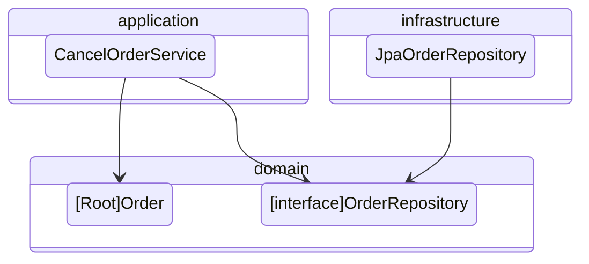

application과 repository는 다음과 같은 밀접한 연관이 있다.
1. application은 필요한 domain 객체를 구하거나 저장할 때 repository를 사용한다.
2. application은 transaction을 관리하는데, transaction 처리는 repository 구현 기술의 영향을 받는다.

repository를 사용하는 주체가 application이기 때문에 repository는 application이 필요하는 메서드를 제공한다.
1. aggregate를 저장하는 메서드
2. aggregate root 식별자로 aggregate를 조회하는 메서드

```java
public interface SomeRepository {
	void save(Some some);
	Some findById(SomeId id);
}
```

# 2.5 요청 처리 흐름


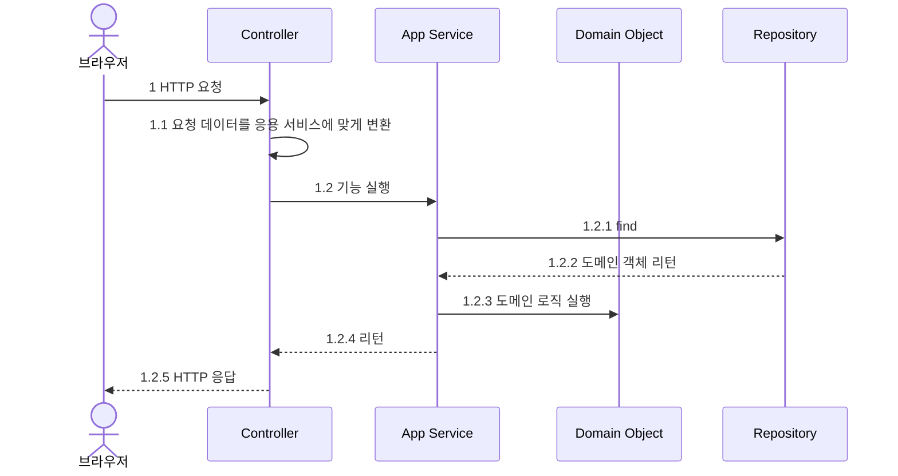

응용 서비스는 도메인 모델을 이용해서 기능을 구현한다. 기능 구현에 필요한 도메인 객체를 리포지터리에서 가져와 실행하거나 신규 도메인 객체를 생성해서 리포지터리에 저장한다.

응용 서비스는 도메인의 상태를 변경하므로 변경 상태가 물리 저장소에 올바르게 반영되도록 트랜잭션을 관리해야 한다.

```java
public class CancelOrderService {  
  
    @Transactional  
    public void cancelOrder(String orderId) {  
        Order order = findOrderById(orderId);  
  
        if (order == null) throw new OrderNotFoundException();  
  
        order.cancel();  
    }   
}
```

# 2.6 인프라스트럭처 개요

infrastructure는 presentation, application, domain 영역을 지원한다. domain 객체의 영속성 처리, transaction, SMTP clinet, RESS client 등 다른 영역에서 필요로 하는 프래임워크, 구현 기수르 보조 기능을 지원한다.

하지만 무조건 infrastructure에 대한 의존을 없앨 필요는 없다. **영속성 처리를 위해 JPA를 사용**할 경우 @Entity나 @Table과 같은 JPA 전용 annotation을 **도메인 모델 클래스에 사용**하는 것이 XML 매핑 설정을 이용하는 것보다 편리하다.

<u>DIP의 장점을 해치지 않는 범위에서 응용 영역과 도메인 영역에서 구현 기술에 대한 의존을 가져가는 것이 나쁘지 않다고 생각한다.</u>

# 2.7 모듈 구성
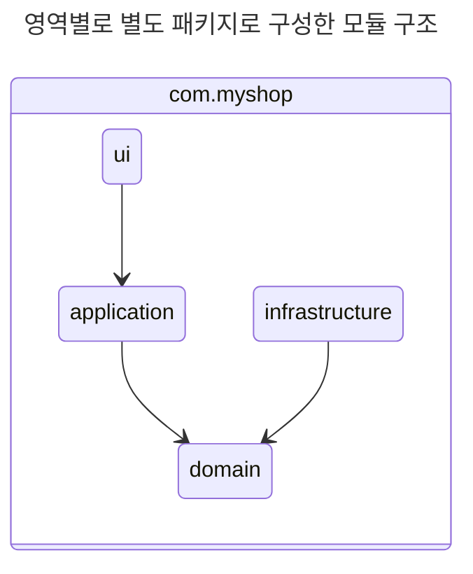
---
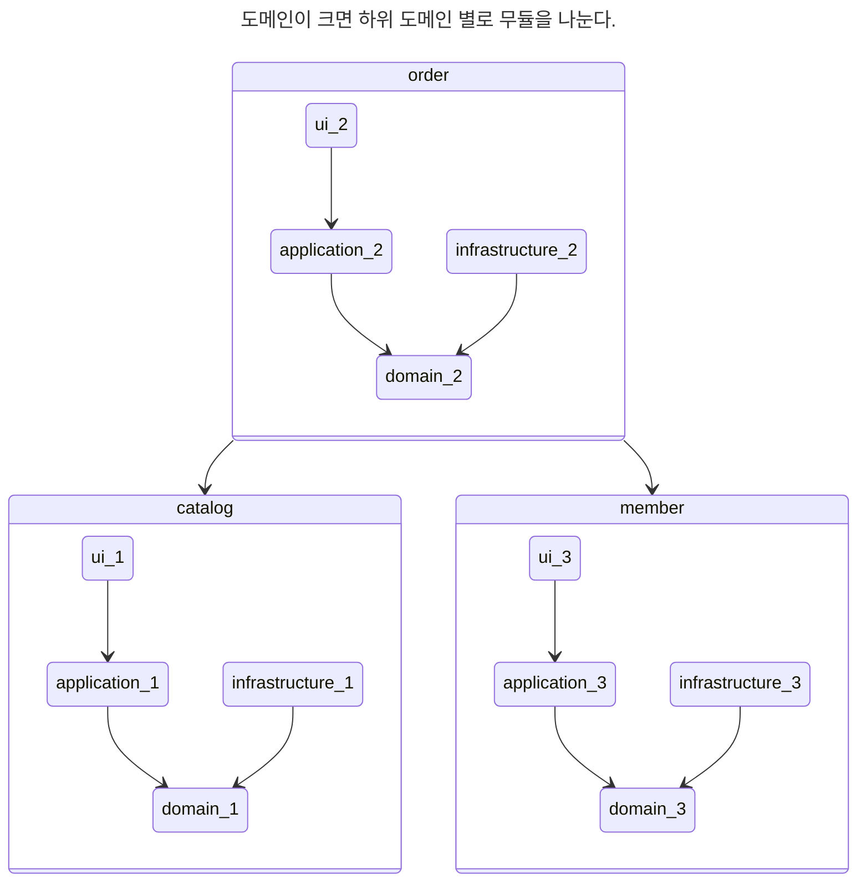
---
도메인 모듈은 도메인에 속한 aggregate를 기준으로 다시 패키지를 구성한다. 예를들어 catalog 하위 domain이 product aggregate와 category aggregate로 구성될 경우 domain을 두 개의 하위 ㅍ패키지로 구성할 수 있다.
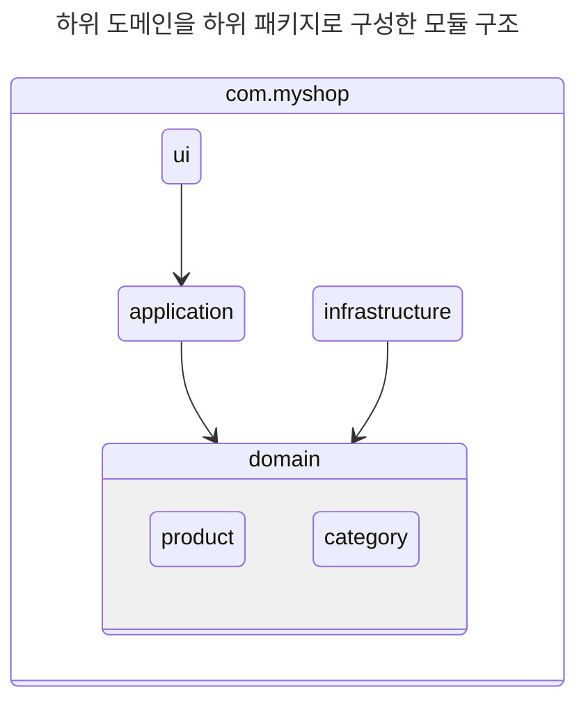

aggregate, model, repository는 같은 패키지에 위치시킨다.

예를들어 주문과 관련된 Order, OrderLine, Orderer, OrderRepository 등은 com.myshop.order.domain 패키지에 위치시킨다.

domain이 복잡하면 domain model과 domain service를 다음과 같이 별도 패키지에 위치시킬 수도 있다.
- com.myshop.order.domain.order: aggregate 위치
- com.myshop.order.domain.service: domain service 위치

application service도 다음과 같이 domain 별로 패키지를 구분할 수 있다.
- com.myshop.catalog.application.product
- com.myshop.catalog.application.category