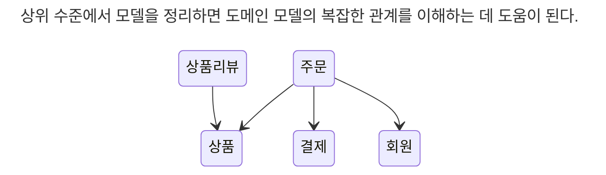
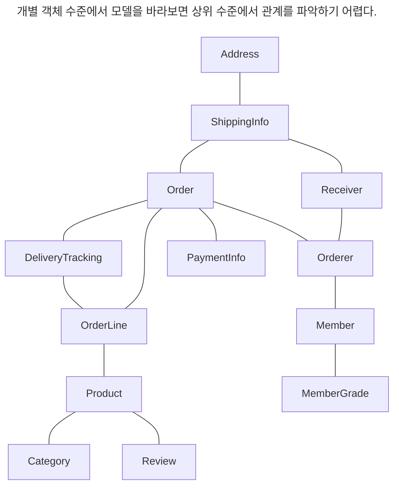
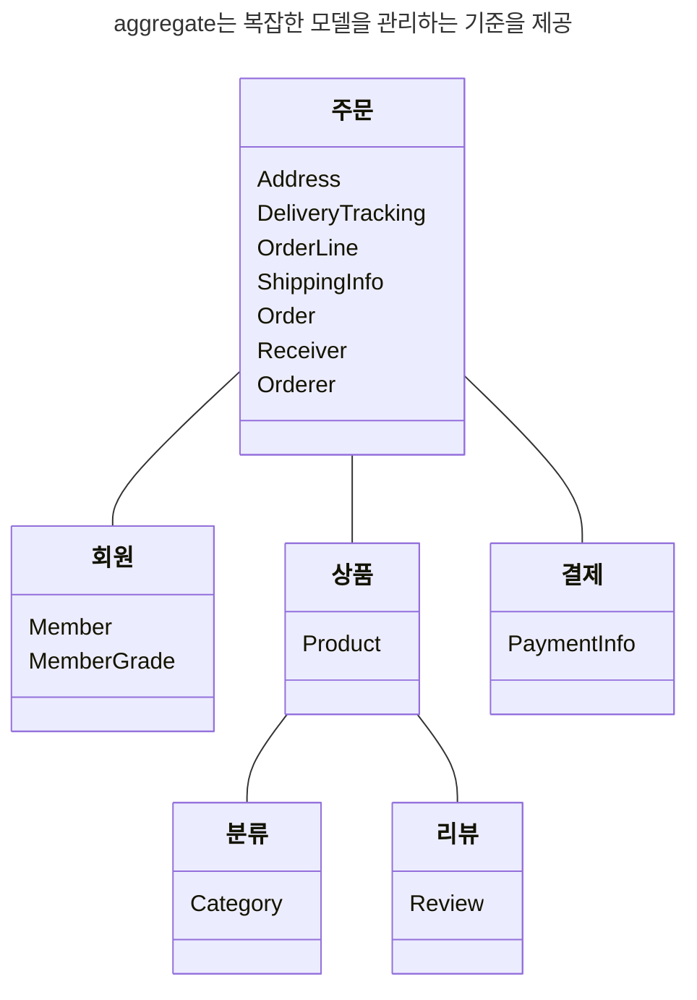
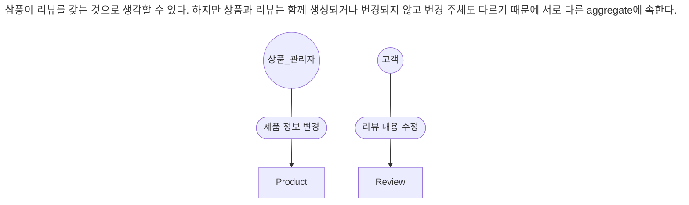
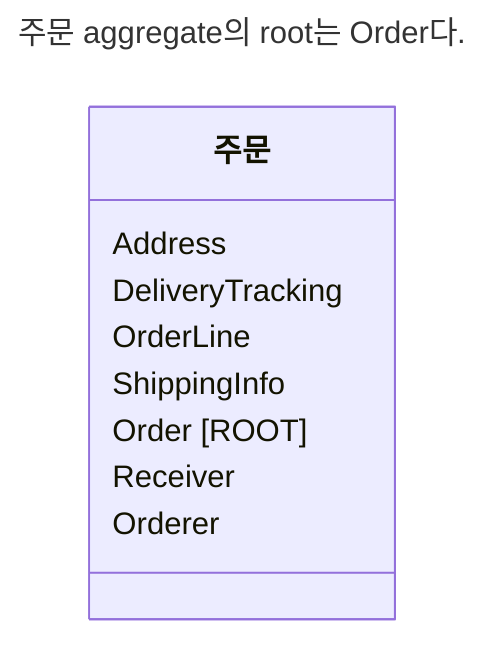
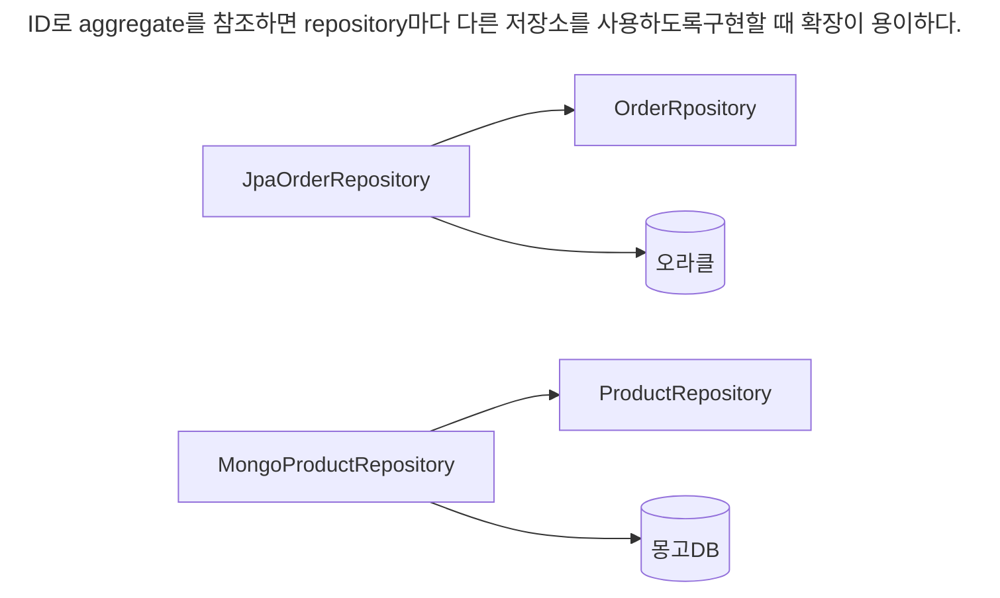
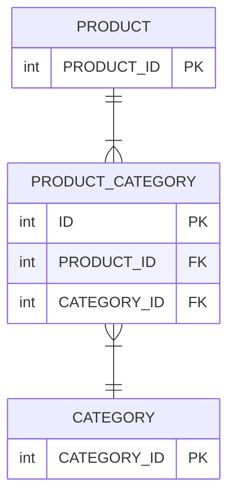

# 3.1 aggregate
시스템을 개발할 때 상위 수준 개념을 이용해서 전체 모델을 정리하면 전반적인 관계를 이해하는 데 도움이 된다.



상위 모델에 대한 이해 없이 상위 수준에서 개념을 파악하려면 더 오랜 시간이 걸린다.

더 많은 코드를 보고 도메인 전문가와 더 많은 대화를 나눠야 비로소 상위 수준에서 모델 간의 관계가 이해되기 시작한다.



==주요 도메인 요소 간의 관계를 파악하기 어렵다는 것은 코드를 변경하고 확장하는 것이 어려워진다는 것을 의미==

==세부적인 모델만 이해한 상태로는 코드를 수정하는 것이 꺼려지기 때문에 코드 변경을 최대한 회피하는 쪽으로 요구사항을 협의하게 된다.==

aggregate는 관련된 객체를 하나의 군으로 묶어 준다. 수많은 객체를 aggregate로 묶어서 바라보면 상위 수준에서 도메인 모델 간의 관계를 파악할 수 있다.



aggregate는 일관성을 관리하는 기준도 된다. 복잡한 domain을 단순한 구조로 만들어준다.

aggregate는 관련된 모델을 하나로 모았기 때문에 aggregate에 속한 객체는 유사하거나 동일한 라이프 사이클을 갖는다.

도메인 규칙에 따라 최초 주문 시점에 일부 객체를 만들 필요가 없는 경우도 있지만 aggregate에 속한 구성요소는 대부분 함께 생성하고 함께 제거한다.

aggregate는 독립된 객체 군이며 각 aggregate는 자기 자신을 관리할 뿐 다른 aggregate는 관리하지 않는다.

aggreagate 경계를 설정할 때 기본이 되는 것은 도메인 규칙과 요구사항이다.


흔히 'A가 B를 갖는다'로 설계할 수 있는 요구사항이 있다면 A와 B를 한 aggregate로 묶어서 생각하기 쉽다. 주문의 경우 Order가 ShippingInfo와 Orderer를 가지므로 어느 정도 타당해 보인다. 하지만 반드시 A와 B가 한 aggregate에 속한다는 것을 의미하는 것은 아니다.

좋은 예가 상품과 리뷰다. 상품을 변경하는 주체가 상품 담장자라면 Review를 생성하고 변경하는 주체는 고객이다.


# 3.2 aggregate root

주문 aggregate는 다음을 포함한다.
- 총 금액인 totalAmounts를 갖고 있는 Order entity
- 개별 구매 상품의 개수인 quantity와 금액인 price를 갖고 있는 OrderLine value

구매할 상품의 개수를 변경하면 한 OrderLine의 quantity를 변경하고 더불어 Order의 totalAmounts도 변경해야 한다. 그렇지 않으면 다음 도메인 규칙을 어기고 데이터 일관성이 깨진다.
- 주문 총 금액은 개별 상품의 주문 개수 * 가격의 합이다.

**aggregate**는 여러 객체로 구성되기 때문에 **한 객체만 상태가 정상이면 안 된다.** domain 규칙을 지키려면 **aggregate에 속한 모든 객체가 정상 상태**를 가져야 한다.

==OrderLine을 변경하면 Order의 totalAmounts도 다시 계산해서 총 금액이 맞아야 한다.==

**aggregate 전체를 관리할 주체가 aggregate root entity다.** aggregate에 속한 객체는 aggregate root entity에 직접 또는 간접적으로 속하게 된다.



## 3.2.1 domain 규칙과 일관성
**aggregate root의 핵심 역할은 aagregate의 일관성이 깨지지 않도록 하는 것**

aggregate root는 aggregate가 제공해야 할 domain 기능을 구현한다. 예를들어 주문 aggregate는 배송지 변경, 상품 변경과 같은 기능을 제공하고, aggregate root인 Order가 이 기능을 구현한 메서드를 제공한다.

aggregate root가 제공하는 메서드는 domain 규칙에 따라 aggregate에 속ㄷ한 객체의 일관성이 깨지지 않도록 구현해야 한다.

배송지 정보를 변경할 수 있다는 규칙이 있다면, aggregate root인 Order의 changeShippingInfo() 메서드는 이 규칙에 따라 배송 시작 여부를 확인하고 규칙을 충족할 때만 배송지 정보를 변경해야 한다.

```java
public class Order {  
   
    public void changeShippingInfo(ShippingInfo newShippingInfo) {  
        verifyNotYetShipped();  
        setShippingInfo(newShippingInfo);  
    }  
  
    private void verifyNotYetShipped() {  
        if (state != OrderState.PAYMENT_WAITING && state != OrderState.PREPARING) {  
            throw new IllegalStateException("already shipped");  
        }  
    }
}
```

aggregate 외부에서 aggregate에 속한 객체를 직접 변경하면 안된다. 이것은 aggregate root가 강제하는 규칙을 적용할 수 없어 모델의 일관성을 깨는 원인이 된다.

```java
ShippingInfo si = order.getShippingInfo();
si.setAddress(newAddress);
```

주문 상태에 상관없이 배송지 주소를 변경하는데, 이는 업무 규칙을 무시하고 직접 DB 테이블의 데이터를 수정하는 것과 같은 결과를 만든다. 즉, 논리적인 데이터 일관성이 깨지게 된다.

불필요한 중복을 피하고 aggregate root를 통해서만 domain 로직을 구현하게 만들려면 domain model에 대해 다음의 두 가지를 습관적으로 적용해야 한다.
1. 단순히 필드를 변경하는 set 메서드를 공개하지 않는다.
2. value type은 불변으로 구현한다.

공개 set 메서드는 domain의 의미나 의도를 표현하지 못하고 domain 로직을 domain 객체가 아닌 application layer나 presentation layer로 분산시킨다. domain 로직이 한 곳에 응집되지 않으므로 코드를 유지 보수할 때에도 분석하고 수정하는 데 더 많은 시간이 필요하다.

value object가 불변이면 value 객체의 값을 변경하는 방법은 새로운 value 객체를 할당하는 것 뿐이다. 즉, 다음과 같이 aggregate root가 제공하는 메서드에 새로운 value 객체를 전달해서 값을 변경하는 방법밖에 없다.

```java
public class Order {  
	private ShippingInfo shippingInfo;
	
    public void changeShippingInfo(ShippingInfo newShippingInfo) {  
        verifyNotYetShipped();  
        setShippingInfo(newShippingInfo);  
    }  
  
    private void setShippingInfo(ShippingInfo shippingInfo) {  
	    if (shippingInfo == null) {  
	        throw new IllegalArgumentException("no ShippingInfo");  
	    }  
	    this.shippingInfo = shippingInfo;  
	}
}
```

value type의 내부 상태를 변경하려면 aggregate root를 통해서만 가능하다. 그러므로 aggregate root가 domain 규칙을 올바르게만 구현하면 aggregate 전체의 일관성을 올바르게 유지할 수 있다.

## 3.2.2 aggregate root의 기능 구현
aggregate root는 aggregate 내부의 다른 객체를 조합해서 기능을 완성한다. 예를들어 Order는 총 주문 금액을 구하기 위해 OrderLine 목록을 사용한다.

```java
public class Order {  
    private List<OrderLine> orderLines;  
    private Money totalAmounts;  

	private void calculateTotalAmounts() {  
	    int sum = orderLines.stream()  
	            .mapToInt(OrderLine::getAmounts)  
	            .sum();  
	    this.totalAmounts = new Money(sum);  
	}
}
```

또 다른 예로 회원을 표현하는 Member aggregate root는 암호를 변경하기 위해 Password 객체에 암호가 일치하는지를 확인할 것이다.

```java
public class Member {
	private Password password;

	public void changePassword(String currentPassword, String newPassword) {
		if (!password.match(currentPassword)) {
			throw new PasswordNotMatchException();
		}
		this.password = new Password(newPassword);
	}
}
```

aggregate root가 구성요소의 상태만 참조하는 것은 아니다. 기능 실행을 위임하기도 한다. 예를들어 구현 기술의 제약이나 내부 모델링 규칙 때문에 OrderLine 목록을 별도 클래스로 분리했다고 해보자.

```java
public class OrderLines {  
    private List<OrderLine> lines;  
  
    public Money getTotalAmounts() {  
        int sum = lines.stream()  
                .mapToInt(OrderLine::getAmounts)  
                .sum();  
          
        return new Money(sum);  
    }  
  
    public void changeOrderLines(List<OrderLine> newLines) {  
	    verifyAtLestOneOrMoreOrderLines(newLines);  
	    this.lines = newLines;  
	}  
	  
	private void verifyAtLestOneOrMoreOrderLines(List<OrderLine> orderLines) {  
	    if (orderLines == null || orderLines.isEmpty()) {  
	        throw new IllegalArgumentException("no OrderLines");  
	    }  
	} 
}
```

이 경우 Order의 changeOrderLines() 메서드는 다음과 같이 내부의 orderLines 필드에 상태 변경을 위임하는 방식으로 기능을 구현한다.

```diff
public class Order {  
-	private List<OrderLine> orderLines;
+    private OrderLines orderLines;  
    private Money totalAmounts;  

	// ...

-	private void setOrderLines(List<OrderLine> orderLines) {
+    private void setOrderLines(List<OrderLine> newOrderLines) {  
-	    verifyAtLestOneOrMoreOrderLines(orderLines);  
-		this.orderLines = orderLines;  
-		calculateTotalAmounts();
+        orderLines.changeOrderLines(newOrderLines);  
+        this.totalAmounts = orderLines.getTotalAmounts();  
    }

-	private void verifyAtLestOneOrMoreOrderLines(List<OrderLine> orderLines) {  
-	    if (orderLines == null || orderLines.isEmpty()) {  
-	        throw new IllegalArgumentException("no OrderLine");  
-	    }  
-	}

-	private void calculateTotalAmounts() {  
-	    int sum = orderLines.stream()  
-	            .mapToInt(OrderLine::getAmounts)  
-	            .sum();  
-	    this.totalAmounts = new Money(sum);  
-	}
  
    // ...
}
```

## 3.2.3 transaction 범위

한 transaction이 한 개 테이블을 수정하는 것과 세 개의 테이블을 수정하는 것을 비교하면 성능에서 차이가 발생한다. 한 개 테이블을 수정하면 transaction 충돌을 막기 위해 잠그는 대상이 한 개 테이블의 한 행으로 한정되지만, 세 개의 테이블을 수정하면 잠금 대상이 더 많아진다. 잠금 대상이 많아진다는 것은 그만큼 동시에 처리할 수 있는 transaction 개수가 줄어든다는 것을 의한다.

동일하게 **한 transaction에서는 한 aggregate만 수정**해야 한다. 한 transaction에서 두 개 이상의 aggregate를 수정하면 transaction 충돌이 발생할 가능성이 더 높아지기 때문에 한 번에 수정하는 aggregate 개수가 많아질수록 전체 처리량이 떨어지게 된다.

aggregate 내부에서 다른 aggregate의 상태를 변경하는 기능을 실행하면 안 된다.

```java
public class Order {
	private Orderer orderer;

	public void shipTo(ShippingInfo newShippingInfo,
			boolean useNewShippingAddrAsMemberAddr) {
		verifyNotYetShipped();
		setShippingInfo(newShippingInfo);

		if(useNewShippingAddrAsMemberAddr) {
			// 다른 aggreate의 상태를 변경하면 안 됨!
			orderer.getMember().changeAddress(newShippingInfo.getAddress());
		}
	}
}
```

aggregate가 자신의 책임 범위를 넘어 다른 aggregate의 상태까지 관리하는 꼴

aggregate는 최대한 서로 독립적이어야 한다. aggregate가 다른 aggregate의 기능에 의존하기 시작하면 aggregate 간 결합도가 높아진다.

부득이하게 한 transaction에서 두 개 이상의 aggregate를 수정해야 한다면 application에서 두 aggregate를 수정하도록 구현한다.

```java
public class changeOrderService {

	@Transactional
	public void changeShippingInfo(OrderId id, ShippingInfo newShippingInfo),
			boolean useNewShippingAddrAsmemberAddr) {

		Order order = orderRepository.findById(id);

		if (order == null) throw new OrderNotFoundException();

		order.shipTo(newShippingInfo);

		if (useNewShippingAsMemberAddr) {
			Member member = findMember(order.getOrderer());
			member.changeAddress(newShippingInfo.getAddress());
		}
	}
}
```

domain event를 사용하면  한 transaction에서 한 개의 aggregate를 수정하면서도 동기나 비동기로 다른 aggregate의 상태로 변경하는 코드를 작성할 수 있다.(10장에서 살펴보자)

# 3.3 repository와 aggregate
Order와 OrderLine을 물리적으로 각각 별도의 DB테치블에 저장한다고 해서 Order와 OrderLine을 위한 repository를 각각 만들지 않는다.

레거시 DB를 사용하거나 팀 내 DB 설계 표준을 따라야 한다면 DB 테이블 구조에 맞게 모델을 변경해야 한다.

aggregate는 개념적으로 하나이므로 repository는 aggregate 전체를 저장소에 영속화해야 한다. 예를들어 Order aggregate와 관련된 테이블이 세 개라면 Order aggregate를 저장할 때 aggregate root와 매핑되는 테이블뿐만 아니라 aggregate에 속한 모든 구성요소에 매핑된 테이블에 데이터를 저장해야 한다.

# 3.4 ID를 이용한 aggregate 참조

```java
public class Order {
	private Orderer orderer;
}

public class Orderer {
	private Member member;
	private String name;
}

public class Memeber {
	private MemberId id;
}
```

aggregate 간의 참조는 필드를 통해 쉽게 구현할 수 있다. 하지만 필드를 이용한 aggregate 참조는 다음 문제를 야기할 수 있다.
1. 편함 탐색 오용
    1. transaction 범위에서 언급한 것처럼 한 aggregate가 관리하는 범위는 자기 자신으로 한정해야 한다.
    2. 한 aggregate에서 다른 aggregate의 상태를 변경하는 것은 aggregate 간의 의존 결합도를 높인다.
2. 성능에 대한 고민
    1. JPA를 사용하면 lazy, eager 로딩에 따라 성능이 달라질 수 있다.
3. 확장 어려움
    1. 사용자가 늘고 트래픽이 증가하면 도메인마다 서로 다른 DBMS를 사용할 때도 있다.

이런 세 가지 문제점을 완화할 때 사용할 수 있는 것이 ID를 이용해서 다른 aggregate를 참조하는 것이다.

```java
public class Order {
	private Orderer orderer;
}

public class Orderer {
	private MemberId memberId;
	private String name;
}

public class Memeber {
	private MemberId id;
}
```

**ID 참조**를 사용하면 모든 객체가 참조로 연결되지 않고 **한 aggregate에 속한 객체들만 참조로 연결**된다. 이는 **aggregate의 경계를 명확히** 하고 aggregate 간 물리적인 연결을 제거하기 때문에 **모델의 복잡도를 낮춰**준다. 또한 aggregate 간의 의존을 제거하므로 **응집도를 높여주는 효과**도 있다.

구현 복잡도도 낮아진다. 참조하는 aggregate가 필요하면 applilcation service에서 ID를 이용해서 로딩하면 된다.

aggregate 별로 다른 구현 기술을 사용하는 것도 가능해진다.



## 3.4.1 ID를 이용한 참조와 조회 성능
다른 aggregate를 ID로 참조하면 참조하는 여러 aggregate를 읽을 때 조회속도가 문제될 수 있다.

한 DBMS에 데이터가 있다면 조인을 이용해서 한 번에 모든 데이터를 가져올 수 있음에도 불구하고 주문마다 상품 정보를 읽어오는 쿼리를 실행하게 된다.

```java
Memeber member = memeberRepository.findById(ordererId)
List<Order> orders = orderRepository.findByORderer(ordererId);

List<OrderView> dtos = orders.stream()
	.map(order -> {
		ProductId productId = order.getOrderLines().get(0).getProductId();

		// 각 주문마다 첫 번째 주문 상품 정보 로딩 위한 쿼리 실행
		Product product = productRepository.finById(productId);

		return new OrderView(order, member, product)l
	}).toList();
```

주문 개수가 10개면 주문을 읽어오기 위한 1번의 쿼리와 주문별로 각 상품을 읽어오기 위한 10번의 쿼리를 실행한다.

ID 참조 방식을 사용하면서 N + 1 조회와 같은 문제가 발생하지 않도록 하려면 조회 전용 쿼리를 사용하면 된다.
예를들어 데이터 조회를 위한 별도 DAO를 만들고 DAO의 조회 메서드에서 조인을 이용해 한 번의 쿼리로 필요한 데이터를 로딩하면 된다.

# 3.5 aggregate 간 집합 연관

카테고리 입장에서 한 카테고리에 한 개 이상의 상품이 속할 수 있으니 카테고리와 상품은 1 : N 관계이다. 한 상품이 한 카테고리에만 속할 수 있다면 상품과 카테고리 관계는 N : 1 이다.

aggregate 간 1 : N 관계는 Set과 같은 컬렉션을 이용해서 표현할 수 있다.

```java
public class Category {  
      
    private Set<Product> products;  
}
```

그런데 개념적으로 존재하는 aggregate 간의 1 : N 연관을 실제 구현에 반영하는 것이 요구사항을 충족하는 것과는 상관없을 때가 있다.

특정 카테고리에 속한 상품 목록을 보여주는 요구사항을 생각해 보자. 보통 목록 관련 요구사항은 한 번에 전체 상품을 보여주기보다는 페이징을 이용해 제품을 나눠서 보여준다.

```java  
public class Category {  
  
    private Set<Product> products;  
      
    public List<Product> getProducts(int page, int size) {  
        List<Product> sortedProducts = sortById(products);  
          
        return sortedProducts.subList((page - 1) * size, page * size);  
    }
}
```

이 코드를 실제 DBMS와 연동해서 구현하면 Category에 속한 Product를 조회하게 된다. Product 개수가 수만 개 정도로 많다면 이 코드를 실행할 때마다 실행 속도가 급격히 느려져 성능에 심각한 문제를 일으킬 것이다.

==개념적으로는 aggregate 간에 1 : N 연관이 있더라도 이런 성능 문제 때문에 실제 구현에 반영하지 않는다.==

```java
public class Product {  
	// ...
    private CategoryId categoryId;  
    // ...
}
```

카테고리에 속한 상품 목록을 제공하는 application service는 다음과 같이 ProductRepository를 이용해서 categoryId가 지정한 category 식별자인 Product목록을 구한다.

```java
public class ProductListService {  
  
    private ProductRepository productRepository;  
    private CategoryRepository categoryRepository;  
  
    public Page<Product> getProductOfCategory(
	    Long categoryId,
	    int page,
	    int size
	) {  
        Category category = categoryRepository.findById(categoryId);  
  
        checkCategory(category);  
  
        List<Product> products = 
		    productRepository.findByCategoryId(category.getId(), page, size);  
  
        int totalCount = productRepository.countsByCategoryId(category.getId());  
  
        return new PageImpl<>(  
                products, PageRequest.of(page, size), totalCount  
        );  
    }  
}
```

M : N 연관은 개념적으로 양쪽 aggregate에 컬렉션으로 연관을 만든다. 상품이 여러 카테고리에 속할 수 있다고 가정하면 카테고리와 상품은 M : N 연관을 맺는다.

보통 특정 카테고리에 속한 상품 목록을 보여줄 때 목록 화면에서 각 상품이 속한 모든 카테고리를 상품 정보에 표시하지는 않는다. 즉 개념적으로는 상품과 카테고리의 양방향 M : N 연관이 존재하지만 실제 구현에서는 상품에서 카테고리로의 단방향 M : N 연관만 적용하면 된다.

RDBMS를 이용해서 M : N 연관을 구현하려면 조인 테이블을 사용한다.



JPA를 이용하면 다음과 같은 매핑 설정을 사용해서 ID 참조를 이용한 M : N 단방향 연관을 구현할 수 있다.

```java
@Entity  
public class Product {  
  
    @EmbeddedId  
    private ProductId id;  
  
    @ElementCollection  
    @CollectionTable(name = "product_category",  
    joinColumns = @JoinColumn(name = "product_id"))  
    private Set<CategoryId> categoryIds;  
}
```

```java
@Repository  
public class JpaProductRepository implements ProductRepository {  
  
    @PersistenceContext  
    private EntityManager em;  
  
    @Override  
    public List<Product> findByCategoryId(CategoryId catId, int page, int size) {  
        TypedQuery<Product> query = em.createQuery(  
                "select p from Product p " +  
                        "where :catId member of p.categoryIds order by p.id.id desc",  
                Product.class);  
  
        query.setParameter("catId", catId);  
        query.setFirstResult((page - 1) * size);  
        query.setMaxResults(size);  
        return query.getResultList();  
    }  
  
    @Override  
    public int countsByCategoryId(CategoryId id) {  
        return 0;  
    }  
}
```

## 3.6 aggregate를 팩토리로 사용하기

고객이 특정 상점을 여러 차례 신고해서 해당 상점이 더 이상 물건을 등록하지 못하도록 차단한 상태라고 해보자. 상품 등록 기능을 구현한 application service는 다음과 같이 상점 계정이 차단 상태가 아닌 경우에만 상품을 생성하도록 구현할 수 있다.

```java
@Transactional  
@RequiredArgsConstructor  
public class RegisterProductService {  
      
    private final ProductRepository productRepository;  
    private final StoreRepository storeRepository;  
  
    public ProductId registerNewProduct(NewProductRequest req) {  
        Store store = storeRepository.findById(req.getStoreId());  
  
        checkNull(store);  
  
        if (store.isBlocked()) {  
            throw new StoreBlockedException();  
        }  
          
        Product product = new Product();  
        productRepository.save(product);  
  
        return product.getProductId();  
    }  
}
```

Product를 생성 가능한지 판단하는 코드와 Product를 생성하는 코드가 분리되어 있다. 코드가 나빠 보이지는 않지만 중요한 도메인 로직 처리가 application service에 노출되었다.

Store가 Product를 생성할 수 있는지를 판단하고 Product를 생성하는 것은 논리적으로 하나의 domain 기능인데 이 **domain 기능을 application service에서 구현하고 있다.**

domain 기능을 넣기 위한 별도의 domain service나 팩토리 class를 만들 수도 있지만 Store aggregate에 구현할 수도 있다.

```diff
public class Store {  
  
+    public Product createProduct() {  
+        if (isBlocked()) throw new StoreBlockedException();  
  
+        return new Product();  
+    }  
  
    public boolean isBlocked() {  
        return false;  
    }  
}
```

```diff
@Transactional  
@RequiredArgsConstructor  
public class RegisterProductService {  
  
    private final ProductRepository productRepository;  
    private final StoreRepository storeRepository;  
  
    public ProductId registerNewProduct(NewProductRequest req) {  
        Store store = storeRepository.findById(req.getStoreId());  
  
        checkNull(store);  
        
-		if (store.isBlocked()) {  
-		    throw new StoreBlockedException();  
-		}  
		  
-		Product product = new Product();
+        Product product = store.createProduct();  
        productRepository.save(product);  
  
        return product.getProductId();  
    }  
}
```

이제 Product 생성 기능 여부를 확인하는 domain 로직을 변경해도 domain 영역의 Store만 변경하면 되고 application service는 영향을 받지 않는다. domain의 응집도도 높아졌다.

==이것이 바로 aggregate를 팩토리도 사용할 때 얻을 수 있는 장점이다.==