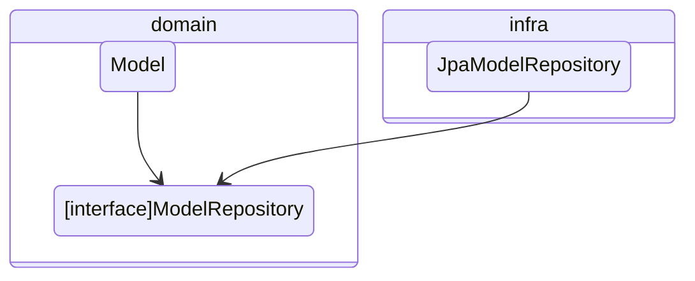
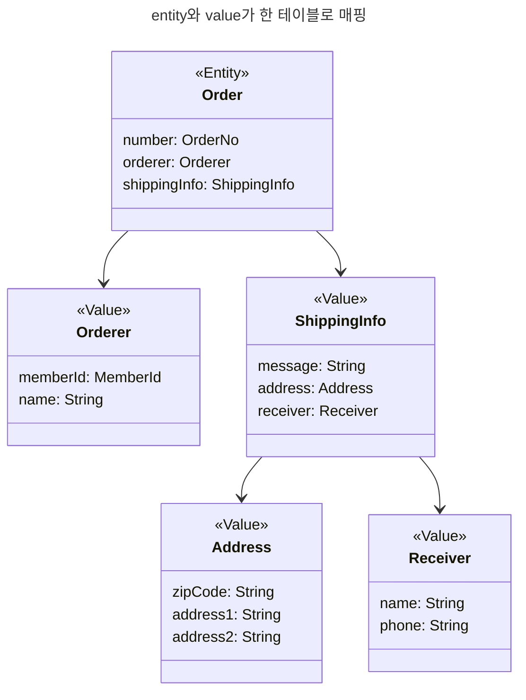
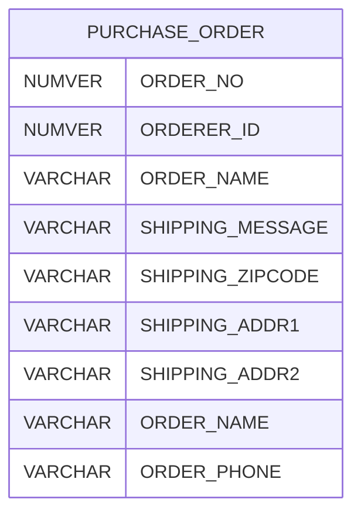
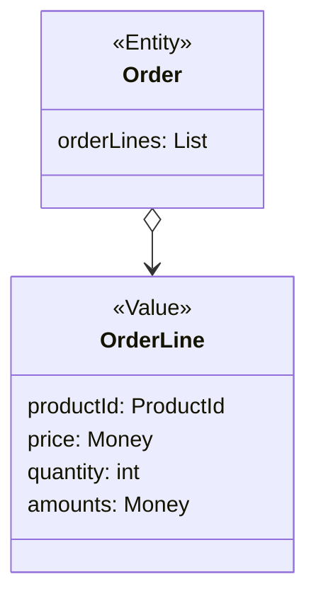
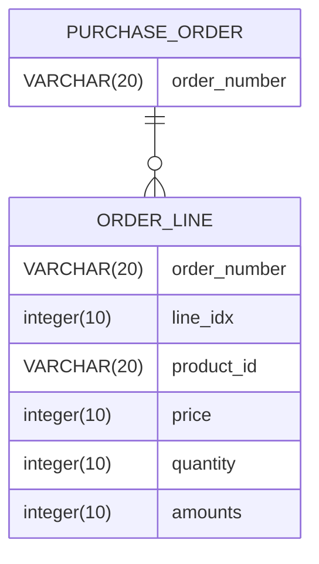
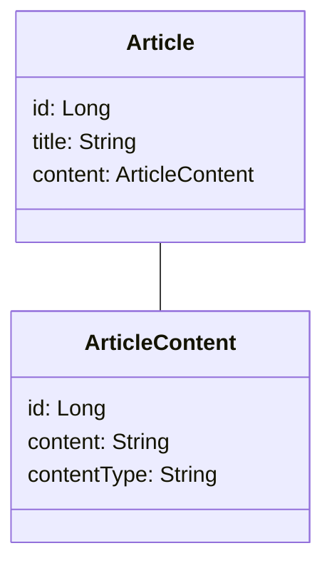
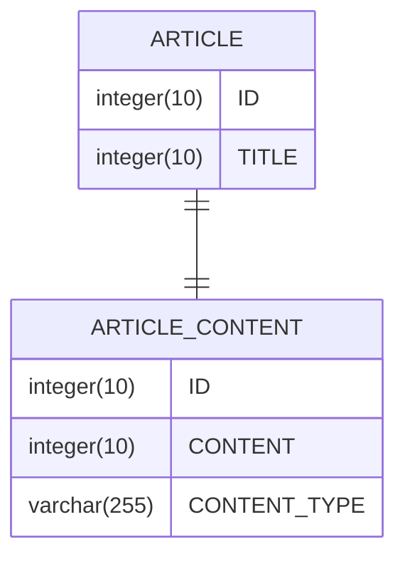
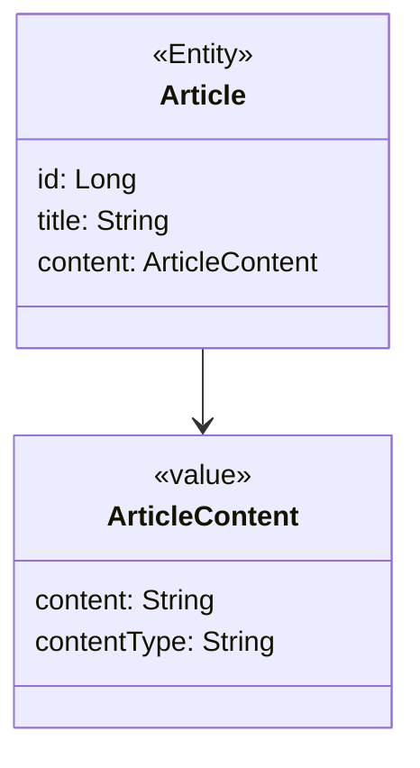
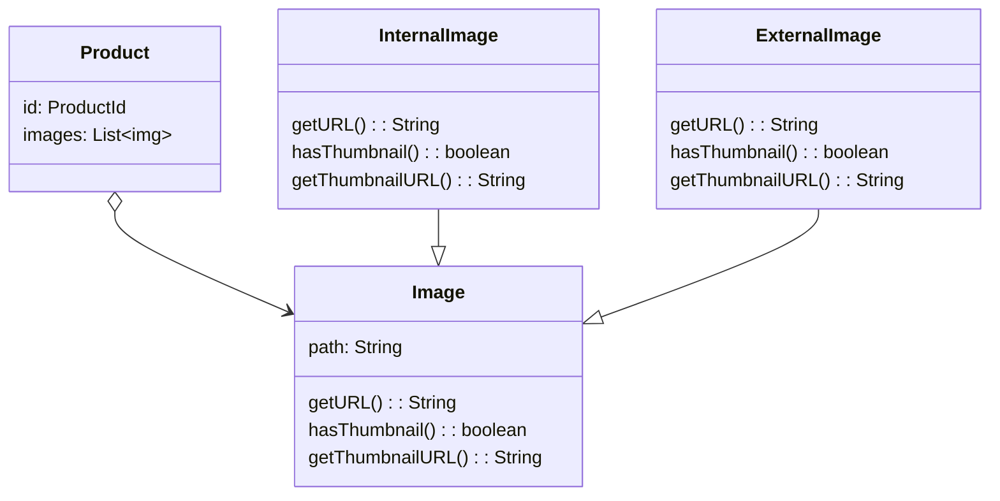
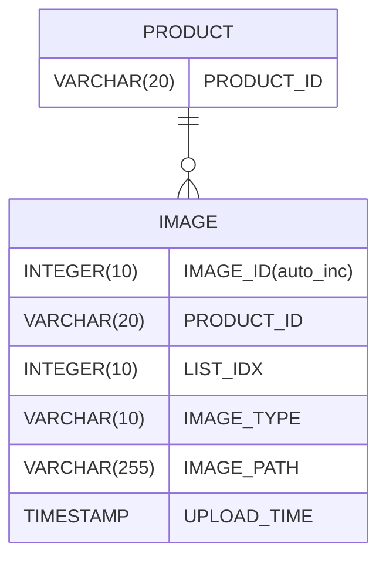

# 4.1 JPA를 이용한 repository 구현
자바의 ORM 표준인 JPA를 이용해서 repository와 aggregate를 구현하는 방법에 대해 알아보자

## 4.1.1 모듈 위치


팀 표준에 따라 repository 구현 class를 domain.impl과 같은 패키지에 위치시킬 수도 있다.
가능하면 repository 구현 class를 infrastructure 영역에 위치시켜서 infrastructure에 대한 의존을 낮춰야 한다.

## 4.1.2 repository 기본 기능 구현
repository가 제공하는 기본 기능은 다음과 같다.
- ID로 aggregate 조회하기
- aggregate 저장하기

```java
public interface OrderRepository {  
    Order findByNumber(OrderNo no);  
    void save(Order order);
}
```

interface는 aggregate root를 기준으로 작성한다.

주문 aggregate는 Order root entity를 비롯해 OrderLine, Orderer, ShippingInfo 등 다양한 객체를 포함한다. 이 구성요소 중에서 root entity인 Order를 기준으로 repository interface를 작성한다.

> [!note]
> DDD와 관련 없는 Spring data JPA는 생략했다.

# 4.3 매핑 구현
## 4.3.1 entitiy와 value 기본 매핑 구현
aggregate와 JPA 매핑을 위한 기본 규칙
- aggregate root는 entity이므로 @Entity로 매핑 설정한다.

한 테이블에 entity와 value가 같이 있다면
- value는 @Embeddable로 매핑 설정
- value type property는 @Embedded로 매핑 설정






```java
@Entity  
@Table(name = "purchase_order")  
@NoArgsConstructor(access = AccessLevel.PROTECTED)  
public class Order {  
  
    @EmbeddedId  
    private OrderNo id;  
  
    @Embedded  
    private OrderLines orderLines;  
  
    @Embedded  
    private Money totalAmounts;  
  
    @Column(name = "state")  
    @Enumerated(EnumType.STRING)  
    private OrderState state;  
  
    @Embedded  
    private ShippingInfo shippingInfo;  
  
    @Embedded  
    private Orderer orderer;  
  
    private String orderNumber;
}
```

```java
@Embeddable  
public class Orderer {  
  
    @Embedded  
    @AttributeOverrides(  
            @AttributeOverride(name = "id", column = @Column(name = "orderer_id"))  
    )  
    private MemberId memberId;  
  
    @Column(name = "orderer_name")  
    private String name;  
}
```

Orderer의 memberId는 Member aggregate를 ID로 참조한다.

```java
@Embeddable  
public class MemberId implements Serializable {  
    @Column(name = "member_id")  
    private String id;  
}
```

```java
@Getter  
@Embeddable  
public class ShippingInfo {  
  
    @Embedded  
    @AttributeOverrides({  
            @AttributeOverride(name = "zipCode", column = @Column(name = "shipping_zipcode")),  
            @AttributeOverride(name = "address1", column = @Column(name = "shipping_addr1")),  
            @AttributeOverride(name = "address2", column = @Column(name = "shipping_addr2"))  
    })  
    private Address address;  
  
    @Embedded  
    private Receiver receiver;
}
```

#### 4.3.2 기본 생성자
```java
@Getter  
@Embeddable  
@NoArgsConstructor(access = AccessLevel.PROTECTED)  
public class Receiver {  
      
    @Column(name = "receiver_name")  
    private String name;  
      
    @Column(name = "receiver_phone")  
    private String phoneNumber;  
  
    public Receiver(String name, String phoneNumber) {  
        this.name = name;  
        this.phoneNumber = phoneNumber;  
    }
}
```

Receiver가 불변 타입이면 생성 시점에 필요한 값을 모두 전달받으므로 값을 변경하는 set 메서드를 제공하지 않는다. 이는 Receiver class에 기본 생성자를 추가할 필요가 없다는 것을 의미한다.

**하지만 JPA에서 @Entity와 @Embeddable로 class를 매핑하려면 기본 생성자를 제공해야 한다.**

기본 생성자는 JPA 프로바이더가 객체를 생성할 때만 사용한다. 이런 이유로 **다른 코드에서 기본 생성자를 사용하지 못하도록 protected로 선언한다.**

#### 4.3.3 필드 접근 방식 사용
JPA는 필드와 메서드의 두 가지 방식으로 매핑을 처리할 수 있다. 메서드 방식을 사용하려면 다음과 같이 프로퍼티를 위한 get/set 메서드를 구현해야 한다.

```diff
+ @Getter  
+ @Setter  
+ @Entity  
+ @Access(AccessType.PROPERTY)  
public class Order {  
    private OrderNo id;  
    private OrderLines orderLines;  
    private Money totalAmounts;  

	@Column(name = "state")
	@Enumerated(EnumType.STRING)
    private OrderState state;  
    
    private ShippingInfo shippingInfo;  
  
    private String orderNumber;
}
```

entity에 property를 위한 공개 get/set 메서드를 추가하면 domain의 의도가 사라지고 객체가 아닌 데이터 기반으로 entity를 구현할 가능성이 높아진다.

특히 set 메서드는 내부 데이터를 외부에서 변경할 수 있는 수단이 되기 때문에 캡슐화를 깨는 원인이 될 수 있다.

객체가 제공할 기능 중심으로 entity를 구현하게끔 유도하려면 JPA 매핑 처리를 property 방식이 아닌 field 방식으로 선택해서 불필요한 get/set 메서드를 구현하지 말아야 한다.

```java
@Entity  
@Table(name = "purchase_order")  
@NoArgsConstructor(access = AccessLevel.PROTECTED)  
@Access(AccessType.FIELD)  
public class Order {  
  
    @EmbeddedId  
    private OrderNo id;  
  
    @ElementCollection(fetch = FetchType.LAZY)  
    private List<OrderLine> orderLines;  
  
    @Convert(converter = MoneyConverter.class)  
    @Column(name = "totalAmounts")  
    private Money totalAmounts;  
  
    @Column(name = "state")  
    @Enumerated(EnumType.STRING)  
    private OrderState state;  
  
    @Embedded  
    private ShippingInfo shippingInfo;  
  
    private String orderNumber;
}
```

#### 4.3.4 AttributeConverter를 이용한 value 매핑 처리
int, long, String, LocalDate 와 같은 타입은 DB 테이블의 한 개 column에 매핑된다. 이와 비슷하게 value 타입의 property를 한 개 column에 매핑해야 할 때도 있다. 예를 들어 Length가 길이 값과 단위의 두 property를 갖고 있는데 DB 테이블에는 한 개 컬럼에 '1000mm'와 같은 형식으로 저장할 수 있다.

```java
public class Length {
	private int value;
	private String unit;
}
```

을 WIDTH VARCHAR(20)에 저장

두 개 이상의 property를 가진 value type을 한 개 칼럼에 매핑하려면 @Embeddable로는 처리할 수 없다.

이럴 때 사용할 수 있는 것이 AttributeConverter다.

```java
public interface AttributeConverter<X, Y> {  
    Y convertToDatabaseColumn(X var1);  
  
    X convertToEntityAttribute(Y var1);  
}
```

X는 value type이고 Y는 DB 타입이다. AttributeConverter 구현체에 @Converter(autoApply = true)를 적용하면 모든 Money type의 property에 대해 자동으로 적용한다.

#### 4.3.5 value collection: 별도 테이블 매핑
Order entity는 한 개 이상의 OrderLine을 가질 수 있다. OrderLine에 순서가 있다면 다음과 같은 List type을 이용해서 collection을 property로 지정할 수 있다.




value collection을 별도 테이블로 매핑할 때는 @ElementConllection과 @CollectionTable을 함께 사용한다.

```java
@Entity  
@Table(name = "purchase_order")  
@NoArgsConstructor(access = AccessLevel.PROTECTED)  
@Access(AccessType.FIELD)  
public class Order {  
  
    @EmbeddedId  
    private OrderNo id;  
  
    @ElementCollection(fetch = FetchType.LAZY)  
    @CollectionTable(name = "order_line", joinColumns = @JoinColumn(name = "order_number"))  
    @OrderColumn(name = "line_idx")  
    private List<OrderLine> orderLines;

	// ...
}
```

```java
@Embeddable  
@NoArgsConstructor(access = AccessLevel.PROTECTED)  
public class OrderLine {  
  
    @Embedded  
    private ProductId productId;  
  
    @Column(name = "price")  
    private Money price;  
  
    private int quantity;  
  
    @Column(name = "amounts")  
    private Money amounts;
}
```

@CollectionTable은 value를 저장할 테이블을 지정한다. name 속성은 테이블 이름을 지정하고 joinColumns 속성은 외부키로 사용할 column을 지정한다. 예제 코드에서는 외부키가 한개인데, 두 개 이상인 경우 @JoinColumn의 배열을 이용해서 외부키 목록을 지정한다.

#### 4.3.6 value collection: 한 개 column 매핑
value collection을 별로 테이블이 아닌 한 개 column에 저장해야 할 때가 있다. 예를 들어 domain model에는 **이메일 주소 목록을 Set**으로 보관하고 **DB에는 한 개 column에 콤마로 구분**해서 저장해야 할 때가 있다. 이때 AttributeConverter를 사용하면 value collection을 한 개 column에 쉽게 매핑할 수 있다.

단, AttributeConverter를 사용하려면 value collection을 표현하는 새로운 value type을 추가해야 한다.
```java
public class EmailSet {  
    private Set<Email> emails = new HashSet<>();  
  
    public EmailSet(Set<Email> emails) {  
        this.emails.addAll(emails);  
    }  
  
    public Set<Email> getEmails() {  
        return Collections.unmodifiableSet(emails);  
    }  
}
```

```java
public class EmailSetConverter implements AttributeConverter<EmailSet, String> {  
    @Override  
    public String convertToDatabaseColumn(EmailSet emailSet) {  
        if (emailSet == null) return null;  
  
        return emailSet.getEmails().stream()  
                .map(Email::getAddress)  
                .collect(Collectors.joining(","));  
    }  
  
    @Override  
    public EmailSet convertToEntityAttribute(String dbData) {  
        if (dbData == null) return null;  
  
        String[] emails = dbData.split(",");  
  
        Set<Email> collect = Arrays.stream(emails)  
                .map(Email::new)  
                .collect(Collectors.toSet());  
  
        return new EmailSet(collect);  
    }  
}
```

```java
@Column(name = "emails")
@Convert(converter = EmailSetConverter.class)
private EmailSet emailSet;
```

#### 4.3.7 value를 이용한 ID 매핑
```java
@Entity  
@Table(name = "purchase_order")  
@NoArgsConstructor(access = AccessLevel.PROTECTED)  
@Access(AccessType.FIELD)  
public class Order {  
  
    @EmbeddedId  
    private OrderNo id;
}

@Embeddable  
@NoArgsConstructor
public class OrderNo implements Serializable {  
  
    @Column(name = "order_number")  
    private String number;
}
```

JPA에서 식별자는 Serializable type이여야 하므로 식별자로 사용할 value type은 Serializable interface를 상속받아야 한다.

**value type으로 식별자를 구현할 때 얻을 수 있는 장점은 식별자에 기능을 추가할 수 있다는 점이다.**

1세대 시스템의 주문번호와 2세대 시스템의 주문번호를 구분할 때 주문번호의 첫 글자를 이용할 경우, OrderNo class에 시스템 세대를 구분할 수 있는 기능을 구현할 수 있다.

```diff
@Embeddable  
@NoArgsConstructor  
public class OrderNo implements Serializable {  
  
    @Column(name = "order_number")  
    private String number;  
  
+    public boolean is2ndGeneration() {  
+        return number.startsWith("N");  
+    }  
}
```

#### 4.3.8 별도 테이블에 저장하는 value 매핑
aggregate에서 root entity를 뺀 나머지 구성요소는 대부분 value이다.

**root entity 외에 또 다른 entity가 있다면 진짜 entity인지 의심해 봐야 한다.**

단지 별도 테이블에 데이터를 저장한다고 해서 entity인 것은 아니다. 주문 aggregate도 OrderLine을 별도 테이블에 저장하지만 OrderLine 자체는 entity가 아니라 value이다.

**value가 아니라 entity가 확실하다면 해당 entity가 다른 aggregate는 아닌지 확인해야 한다.**
자기만의 독자적인 라이프 사이클을 갖는다면 구분되는 aggregate일 가능성이 높다.

aggregate에 속한 객체가 value인지 entity인지 구분하는 방법은 고유 식별자를 갖는지를 확인하는 것

식별자를 찾을 때 매핑되는 테이블의 식별자를 aggregate 구성요소의 식별자와 동일한 것으로 착각하면 안 된다. 별도 테이블로 저장하고 테이블에 PK가 있다고 해서 테이블과 매핑되는 aggregate 구성요소가 항상 고유 식별자를 갖는 것은 아니기 때문이다.





ArticleContent를 entity로 생각할 수 있지만 Article의 내용을 담고 있는 value로 생각하는게 맞다.

식별자가 있긴 하지만 ARTICLE 테이블의 데이터와 연결하기 위함이지 ARTICLE_CONTENT를 위한 별도 식별자가 필요하기 때문은 아니다.



ArticlContent는 value이므로 @Embeddable로 매핑한다. 이때 value를 매핑 한 테이블을 지정하기 위해 @SecondaryTable과 @AttributeOverride를 사용한다.

```java
@Entity  
@NoArgsConstructor(access = AccessLevel.PROTECTED)  
@SecondaryTable(  
        name = "article_content",  
        pkJoinColumns = @PrimaryKeyJoinColumn(name = "id")  
)  
public class Article {  
  
    @Id  
    @GeneratedValue(strategy = GenerationType.IDENTITY)  
    private Long id;  
  
    private String title;  
  
    @Embedded  
    @AttributeOverrides({  
            @AttributeOverride(  
                    name = "content",  
                    column = @Column(table = "article_content", name = "content")),  
            @AttributeOverride(  
                    name = "contentType",  
                    column = @Column(table = "article_content", name = "content_type")  
            )  
    })  
    private ArticleContent articleContent;  
}
```

> [!note]
> @SecondaryTable을 사용하면 Article을 조회할 때 ArticleContent까지 조인해서 데이터를 읽어온다.
> 이 문제를 해결하기 위해 ArticleContent를 Entity로 만들고 지연로딩을 시킬 수 있지만 value를 entity로 만드는 것으로 좋은 방법은 아니다. 5장과 11장에서 해당 방법에 대해 알아볼 것이다.

#### 4.3.9 value collection을 @Entity로 매핑하기
개념적으로 value인데 @Entity를 사용해야 할 때도 있다.

제품의 이미지 업로드 방식에 따라 이미지 경로와 섬네일 이미지 제공 여부가 달라진다고 해보자. 이를 위해 Image를 계층 구조로 설계할 수 있다.



JPA는 @Embeddable type class 상속 매핑을 지원하지 않는다. 상속 구조를 갖는 value type을 사용하려면 @Entity를 이용해서 상송 매핑으로 처리해야 한다.

value type을 @Entity로 매핑하므로 식별자 매핑을 위한 필드도 추가해야 한다. 또한 구현 class를 구분하기 위한 type 식별 column을 추가해야 한다.



한 테이블에 Image와 그 하위 class를 매핑하므로 Image class에 다음 설정을 사용한다.
- @Inheritance 사용
- strategy 값으로 SINGLE_TABLE tkdyd
- @DiscriminatorColumn을 이용하여 type 구분용으로 사용할 column 지정

```java
@Entity  
@Inheritance(strategy = InheritanceType.SINGLE_TABLE)  
@DiscriminatorColumn(name = "image_type")  
@Table(name = "image")  
@NoArgsConstructor(access = AccessLevel.PROTECTED)  
public abstract class Image {  
  
    @Id  
    @GeneratedValue(strategy = GenerationType.IDENTITY)  
    @Column(name = "image_id")  
    private Long id;  
  
    @Column(name = "image_path")  
    private String path;  
  
    @Temporal(TemporalType.TIMESTAMP)  
    @Column(name = "upload_time")  
    private Date uploadTime;  
  
    public Image(String path) {  
        this.path = path;  
        this.uploadTime = new Date();  
    }  
  
    protected String getPath() {  
        return path;  
    }  
  
    public Date getUploadTime() {  
        return uploadTime;  
    }  
  
    public abstract String getURL();  
    public abstract boolean hasThumbnail();  
    public abstract String getThumbnailURL();  
}
```

Image는 value이므로 독자적인 라이프 사이클을 갖지 않고 Product에 완전히 의존한다. 따라서 Product를 저장할 때 함께 저장되고 Product를 삭제할 때 함께 삭제되도록 cascade 속성을 지정한다. 리스트에서 Image value를 제거하면 DB에서 함께 삭제되도록 orphanRemoval도 true로 설정한다.

@Entity에 대한 @OneToMany 매핑에서 collection의 clear() 메서드를 호출하면 삭제 과정이 효율적이지 않다.

hybernate의 경우 select query로 대상 entity를 로딩하고, 각 개별 entity에 대하여 delete query를 실행한다. Image 개수가 4개면 select 한번과 delete 4번이 실행된다.

hybernate는 @Embeddable type에 대한 collection의 clear() 메서드를 호출하면 객체를 로딩하지 않고 한번의 delete query로 삭제 처리를 수행한다.

따라서, aggregate 특성을유지하면서 이 문제를 해소하려면 결국 상속을 포기하고 @Embeddable로 매핑된 단일 class로 구현해야 한다.

```diff
- @Entity  
- @Inheritance(strategy = InheritanceType.SINGLE_TABLE)  
- @DiscriminatorColumn(name = "image_type")  
- @Table(name = "image")
+ @Embeddable
@NoArgsConstructor(access = AccessLevel.PROTECTED)  
- public abstract class Image {  
+ public class Image {  
  
-    @Id  
-    @GeneratedValue(strategy = GenerationType.IDENTITY)  
-    @Column(name = "image_id")  
-    private Long id;  
+	private String imageType;
	
  
    @Column(name = "image_path")  
    private String path;  
  
    @Temporal(TemporalType.TIMESTAMP)  
    @Column(name = "upload_time")  
    private Date uploadTime;  
  
    public Image(String path) {  
        this.path = path;  
        this.uploadTime = new Date();  
    }  
  
-    protected String getPath() {  
+    public String getPath() {  
        return path;  
    }  
  
    public Date getUploadTime() {  
        return uploadTime;  
    }  
  
-    public abstract String getURL();  
-    public abstract boolean hasThumbnail();  
-    public abstract String getThumbnailURL();  

+	public boolean hasThumbnail() {  
+	    return imageType.equals("II");  
+	}
}
```

#### 4.3.10 ID 참조와 조인 테이블을 이용한 단방향 M-N 매핑
3장에서 aggregate간 집합 연관은 성능 상의 이유로 피해야 한다고 했다. 그럼에도 요구사항을 구현하는 데 집합 연관을 사용하는 것이 유리하다면 ID 참조를 이용한 단방향 집합 연관을 적용할 수 있다.

```java
@Entity  
@NoArgsConstructor  
public class Product {  
  
    @EmbeddedId  
    private ProductId id;  
  
    @ElementCollection  
    @CollectionTable(name = "product_category",  
            joinColumns = @JoinColumn(name = "product_id"))  
    private Set<CategoryId> categoryIds;  
  
    public Product(Set<CategoryId> categoryIds) {  
        this.categoryIds = categoryIds;  
    }  
  
    public ProductId getProductId() {  
        return id;  
    }  
  
    @ElementCollection  
    @CollectionTable(name = "product_image",  
            joinColumns = @JoinColumn(name = "product_id"))  
    private List<Image> images = new ArrayList<>();  
  
    public void changeImages(List<Image> newImages) {  
        images.clear();  
        images.addAll(newImages);  
    }  
}
```

## 4.4 aggregate 로딩 전략
JPA 매핑을 설정할 때 항상 기억해야 할 점은 aggregate에 속한 객체가 모두 모여야 완전한 하나가 된다는 것

조회 시점에 aggregate를 완전한 상태가 되도록 하려면 조회 방식을 즉시 로딩으로 설정하면 된다.

그러나 collection에 대해 즉시 로딩 방식을 사용하면 문제가 될 수 있다.

```java
@Entity  
@NoArgsConstructor  
public class Product {  
  
    @EmbeddedId  
    private ProductId id;  
  
    @OneToMany(cascade = {CascadeType.PERSIST, CascadeType.REMOVE},  
            orphanRemoval = true, fetch = FetchType.EAGER)  
    @JoinColumn(name = "product_id")  
    private Set<Category> categories= new HashSet<>();  
  
    public ProductId getProductId() {  
        return id;  
    }  
    
    @OneToMany(cascade = {CascadeType.PERSIST, CascadeType.REMOVE},  
            orphanRemoval = true, fetch = FetchType.EAGER)  
    @JoinColumn(name = "product_id")  
    private Set<Image> images = new HashSet<>();  
  
    public void changeImages(Set<Image> newImages) {  
        images.clear();  
        images.addAll(newImages);  
    }  
  
    public Product(ProductId id, Set<Category> categories, Set<Image> images) {  
        this.id = id;  
        this.categories = categories;  
        this.images = images;  
    }  
}
```

```text
select p1_0.product_id
	 , c1_0.product_id
	 , c1_0.image_id
	 , c1_0.id
	 , i1_0.product_id
	 , i1_0.image_id
	 , i1_0.image_type
	 , i1_0.image_path
	 , i1_0.upload_time
  from product p1_0
  left join category c1_0
	on p1_0.product_id=c1_0.product_id
  left join image i1_0
	on p1_0.product_id=i1_0.product_id
where p1_0.product_id=?
```

> [!note]
> 예제대로 코드를 작성했을 경우 left join을 1번만 한다.
> List<>의 경우 select를 하기 때문에 Set<>으로 변경하였다.

이 쿼리는 카타시안(Cartesian) 조인을 사용하고 이는 쿼리 결과에 중복을 발생시킨다.

물론 hybernate가 중복된 데이터를 알맞게 제거한다. 그러나 aggregate가 커지면 문제가 될 수 있다. 이미자가 20개고 Product가 15개 이면 300행을 리턴한다.

보통 조회 성능 문제 때문에 즉시 로딩 방식을 사용하지만 이렇게 조회되는 데이터 개수가 많아지면 즉시 로딩 방식을 사용할 때 성능을 검토해 봐야 한다.

aggregate는 개념적으로 하나여야 한다. 하지만 root entity를 로딩하는 시점에 aggregate에 속한 객체를 모두 로딩해야 하는 것은 아니다.

JPA는 transaction 범위 내에서 지연 로딩을 허용하기 때문에 실제로 상태를 변경하는 시점에 필요한 구성요소만 로딩해도 문제가 되지 않는다.

## 4.5 aggregate의 영속성 전파
aggregate가 완전한 상태여야 한다는 것은 aggregate root를 조회할 때뿐만 아니라 저장하고 삭제할 때도 하나로 처리해야 함을 의미한다.
- 저장 메서드는 aggregate root만 저장하면 안 되고, aggregate에 속한 모든 객체를 저장해야 한다.
- 삭제 메서드는 aggregate root뿐만 아니라 aggregate에 속한 모든 객체를 삭제해야 한다.

@Embeddable 매핑 type은 함께 저장되고 삭제되므로 cascade 속성을 추가로 설정하지 않아도 된다. 반면에 aggregate에 속한 @Entity type에 대한 매핑은 cascade 속성을 사용해서 저장과 삭제 시에 함께 처리되도록 설정해야 한다.

## 4.6 식별자 생성 기능
식별자는 크게 세 가지 방식 중 하나로 생성한다.
- 사용자가 직접 생성
- 도메인 로직으로 생성
- DB를 이용한 일련번호 사용

식별자 생성 규칙이 있다면 Entity를 생성할 때 식별자를 Entity가 별도 service로 식별자 생성 기능을 분리해야 한다. 식별자 생성 규칙은 domain 규칙이므로 domain 영역에 식별자 생성 기능을 위치시켜야 한다.
```java
public class ProductIdService {
	public ProductId nextId() {
		// 정해진 규칙으로 식별자 생성
	}
}
```

appclication service는 이 domain service를 이용해서 식별자를 구하고 entity를 생성한다.
```java
public class CreateProductservice {
	private final ProductIdService productIdService;
	private final ProductRepository productRepository;

	@Tansactional
	public ProductId createProduct(ProductCreationCommand cmd) {
		ProductId id = productIdService.nextId();
		Product product = new Product(id, cmd.getDetail(), ...);
		productRepository.save(product);
		return id;
	}
}
```

특정 값의 조합으로 식별자가 생성되는 것 역시 규칙이므로 domain service를 이용해서 식별자를 생성할 수 있다.
```java
public class OrderIdService {
	public OrderId createId(UserId userId) {
		if (userId == null) {
			throw new IllegalArgumentException("invalid userid: " + userId);
		}
		return new OrderId(userId.toString() + "-" + timestamp());
	}

	private String timestamp() {
		return Long.toString(System.currentTimeMillis());
	}
}
```

## 4.7 domain 구현과 DIP
DIP에 따르면 @Entity, @Table은 구현 기술에 속하므로 Article과 같은 domain model은 구현 기술인 JPA에 의존하지 말아야 한다.

DIP를 적용하는 주된 이유는 저수준 구현이 변경되더라도 구수준이 영향을 받지 않도록 하기 위함이다. 하지만 repository와 domain의 구현 기술은 거의 바뀌지 않는다.

==변경이 거의 없는 상황에서 변경을 미리 대비하는 것은 과하다고 생각한다==