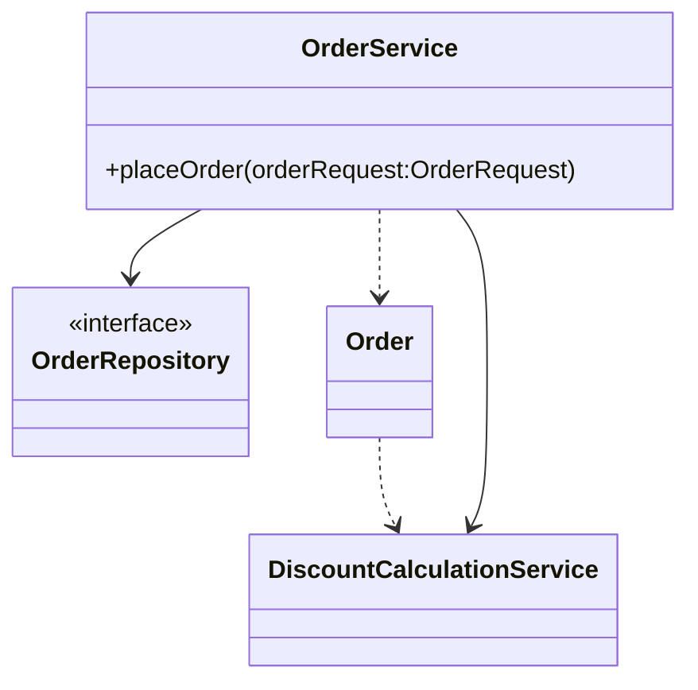
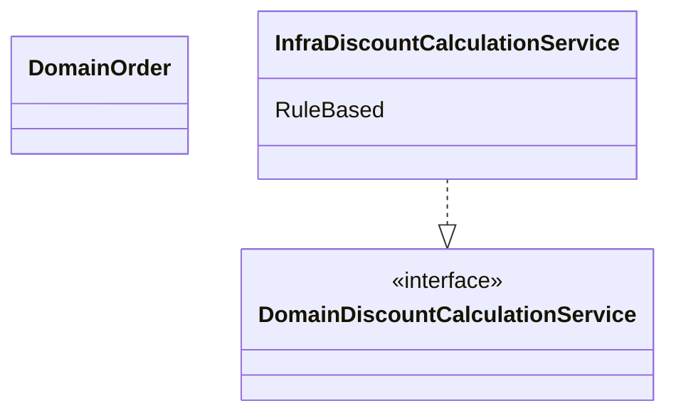

## 7.1 여러 aggregate가 필요한 기능
domain 영역의 코드를 작성하다 보면, 한 aggregate로 기능을 구현할 수 없을 때가 있다.
- 상품 aggregate : 구매하는 상품의 가격이 필요. 상품에 따라 배송비가 추가되기도 함
- 주문 aggregate : 상품별로 구매 개수가 필요
- 할인 쿠폰 aggregate : 쿠폰별로 지정한 할인 금액이나 비율에 따라 주문 총 금액을 할인. 할인 쿠폰을 조건에 따라 중복 사용하거나 지정한 카테고리의 상품에만 적용
- 회원 aggregate : 회원 등급에 따라 추가할인

이 상황에서 실제 결제 금액을 계산해야 하는 주체는 어떤 aggregate일까?

1. 총 주문 금액을 계산하는 것은 주문 aggregate 하지만 실제 결제 금액은 다른 이야기
2. 총 주문 금액에서 할인 금액을 계산해야 하는데, 할인 금액을 구하는 것은 누구 책임? 할인 쿠폰이 할인 규칙을 갖고 있으니 할인 쿠폰 aggregate가 계산?
3. 할인 쿠폰을 두 개 이상 적용할 수 있다면 단일 할인 쿠폰 aggregate로 총 결제 금액을 계산할 수 없다.

생각해 볼 수 있는 방법은 주문 aggregate가 필요한 데이터를 모두 가지도록 한 뒤 할인 금액 계산 책임을 주문 aggregate에 할당하는 것

```java
private List<Coupon> usedCoupons;

private Money calculatePayAmounts() {
	Money totalAmounts = calculateTotalAmounts();

	// 쿠폰별로 할인 금액을 구함
	Money discount = coupons.stream()
						.map(coupon -> calcutaleDiscount(coupon))
						.reduce(Money(0), (v1, v2) -> v1.add(v2));

	// 회원에 따른 추가 할인
	Money membershipDiscount = calculateDiscount(orderer.getMomber().getGrade());

	return totalAmounts.minus(discount).minus(membershipDiscount);
}

private Money calculateDiscount(Coupon coupon) {
	// orderLines의 각 상품에 대한 쿠폰을 적용해서 할인 금액 계산하는 로직.
	// 쿠폰의 적용 조건 등을 확인하는 코드
	// 정책에 따라 복잡한 if-else와 계산 코드
	// ...
}

private Money calculateDiscount(MemberGrade grade) {
	// 등급에 따라 할인 금액 계산
}
```

여기서 결제 금액 계산 로직이 주문 aggregate의 책임이 맞을까? 예를들어 특별 감사 세일로 전 품목에 대해 한 달간 2% 추가 할인을 하기로 했다고 해보자. 이 할인 정책은 주문 aggregate가 갖고 있는 구성요소와는 관련이 없음에도 결제 금액 계산 책임이 주문 aggregate에 있다는 이유로 주문 aggregate 코드를 수정해야 한다.

이렇게 한 aggregate에 넣기 애매한 domain 기능을 억지로 특정 aggregate에 구현하면 안 된다.

자신의 챔임 범위를 넘어서는 기능을 구현하기 때문에 코드가 길어지고 외부에 대한 의존이 높아지게 된다.

해결 방법은 domain 기능을 별도 service로 구현하는 것이다.

## 7.2 domain service
domain service는 domain 영역에 위치한 domain 로직을 표현할 때 사용
- 계산로직 : 여러 aggregate가 필요한 계산 로직이나. 한 aggregate에 넣기에는 다소 복잡한 로직
- 외부 시스템 연동이 필요한 domain 로직 : 구현하기 위해 타 시스템을 사용해야 하는 domain 로직

#### 7.2.1 계산 로직과 domain service
할인 금액 규칙 계산처럼 한 aggregate에 넣기 애매한 domain 개념을 구현하려면 domain service를 이용해서 domain 개념을 명시적으로 드러내면 된다.

domain service는 상태 없이 로직만 구현한다. 필요한 상태는 다른 방법으로 전달받는다.

할인 금액 계산 로직을 위한 domain service는 domain의 의미가 드러나는 용어를 type과 메서드 이름으로 갖는다.

할인 계산 service를 사용하는 주체는 aggregate가 될 수도 있고 application service가 될 수도 있다.
```java
public class Order {
	public void calcultaeAmounts(DiscountCalculationService disCalSvc, MemberGrade grade) {
		Money totalAmounts = getTotalAmounts();
		Money discountAmounts = disCalSvc.calculateDiscountAmounts(this.orderLines, this.coupons, grade);
		this.paymentAmounts = totalAmounts.minus(discountAmounts);
	}
}

public class OrderService {
	private DiscountCalculationService discountCalculationService;

	@Transactional
	pubilc OrderNo placeOrder(OrderRequest orderRequest) {
		OrderNo orderNo = orderRepository.nextId();
		Order order = createOrder(orderNo, orderRequest);
		orderRepository.save(order);

		// application service 실행 후 presentation 영역에서 필요한 값 리턴
		return orderNo;
	}

	private Order createOrder(OrderNo orderNo, OrderRequest orderReq) {
		Member member = findMember(orderReq.getOrdererId());
		
		Order order = new Order(orderNo, orderReq.getOrderLines(),
				orderReq.getCoupons(), createOrderer(member),
				orderReq.getShippingInfo());
		
		order.calculateAmounts(this.discountCalculationService,
			member.getGrade());

		return order;
	}
}
```

**aggregate 메서드를 실행할 때 domain service를 인자로 전달하지 않고 반대로 domain service의 기능을 실행할 때 aggregate를 전달하기도 한다.**

이런 식으로 동작하는 것 중 하나가 계좌 이체 기능이다. 계좌 이체는 aggregate가 관여하는데 한 aggregate는 금액을 출금하고 한 aggregate는 금액을 입금한다.
```java
public class transferService {
	public void transfer(Acount fromAcc, Account toAcc, Money amounts) {
		fromAcc.withdraw(amounts);
		toAcc.credit(amount);
	}
}
```

application service는 두 Account aggregate를 구한 뒤에 해당 domain 영역의 TransferService를 이용해서 계좌 이체 domain 기능을 실행할 것이다.

> [!note]
> 특정 기능이 domain service인지 헷갈릴 때
> - 해당 로직이 aggregate의 상태를 변경하거나
> - aggregate의 상태 값을 계산하는지 확인

#### 7.2.2 외부 시스템 연동과 domain service
외부 시스템이나 타 domain과의 연동 기능도 domain service가 될 수 있다.

설문 조사 시스템과 사용자 역할 관리 시스템이 분리되어 있다고 하자. 설문 조사를 생성할 때 사용자가 생성 권한을 가진 역할인지 확인하기 위해 역할 관리 시스템과 연동해야 한다.

시스템 간 연동은 API 호출로 이루어질 수 있지만 설문 조사 domain 입장에서는 사용자가 설문 조사 생성 권한을 가졌는지 확인하는 domain 로직으로 볼 수 있다.

이 domain 로직은 domain service로 표현할 수 있다. 여기서 중요한 점은 domain 로직 관점에서 interface를 작성했다는 것이다.

```java
public interface SurveyPermissionChecker {
	boolean hasUserCreationPermission(String userId);
}
```

application service는 이 domain service를 이용해서 생성 권한을 검사한다.
```java
public class CreateSurveyService {
	private SurveyPermissionChecker permissionChecker;

	public Long createSurvey(CreateSurveyRequest req) {
		validate(req);

		if (!permissionChecker.hasUserCreationPermission(req.getRequestorId())) {
			throw new NoPermissionException();
		}
	}
}
```

SurveyPermissionChecker interface를 구현한 class는 infrastructure 영역에 위치해 연동을 포함한 권한 검사 기능을 구현한다.

#### 7.2.3 domain service의 패키지 위치
domain service는 domain 로직을 표현하므로 domain service 위치는 다른 domain 구성요소와 동일한 패키지에 위치한다.



domain service의 개수가 많거나 entity나 value와 같은 다른 구성요소와 명시적으로 구분하고 싶다면 domain 패키지 및에 domain.model, domain.service, domain.repository와 같이 하위 패키지를 구분하여 위치시킨다.

#### 7.2.4 domain service의 interface와 class
domain service의 로직이 고정되어 있지 않은 경우 domain service 자체를 interface로 구현하고 이를 구현한 class를 둘 수도 있다.

특히 domain 로직을 외부 시스템이나 별도 엔진을 이용해서 구현할 때 interface와 class를 분리하게 된다.



domain service의 구현이 특정 구현 기술에 의존하거나 외부 시스템의 API를 실행한다면 domain 영역의 domain service는 interface로 추상화해야 한다.

이를 통해 도메인 영역이 특정 구현에 종속되는 것을 방지할 수 있고 domain 영역에 대한 테스트가 쉬워진다.