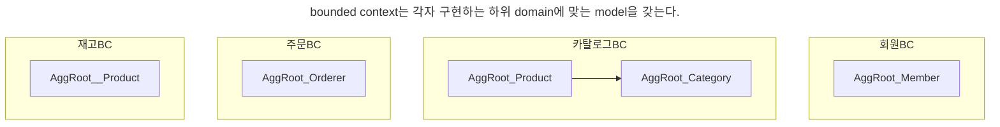
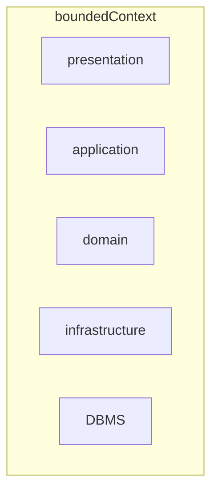
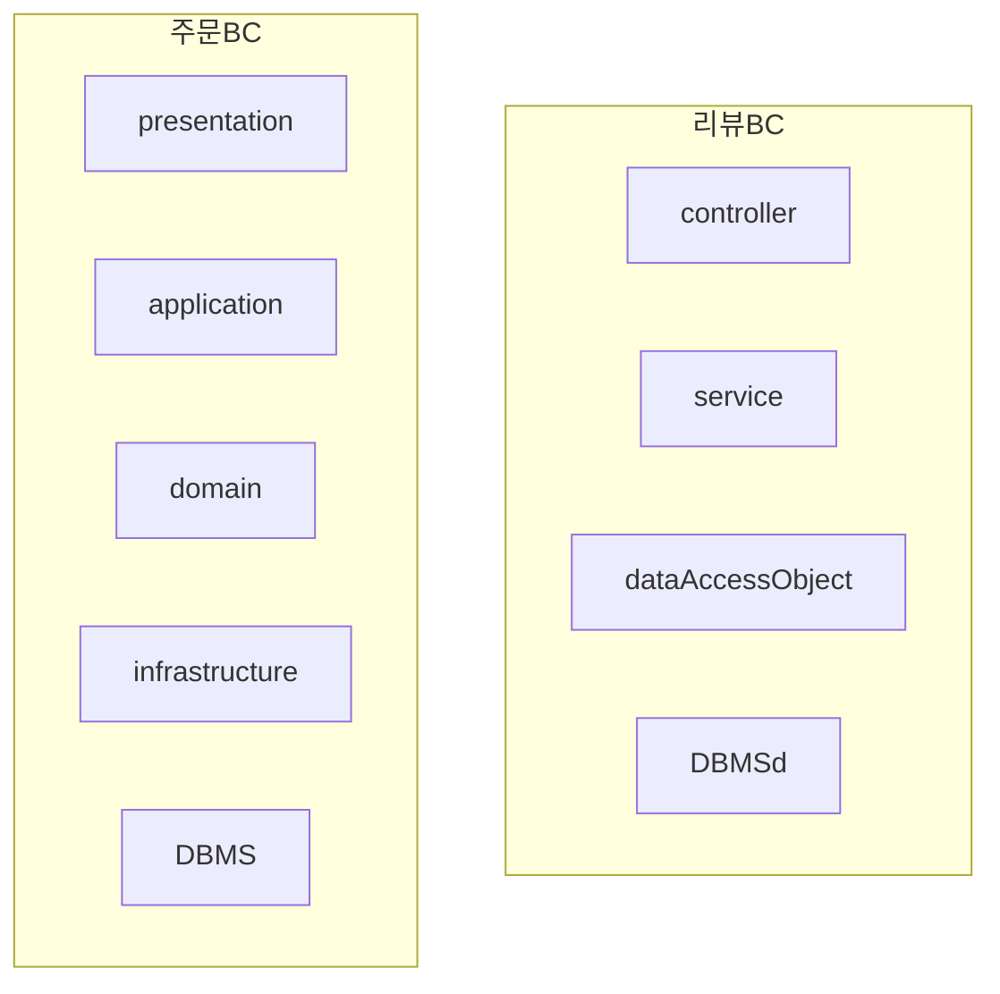
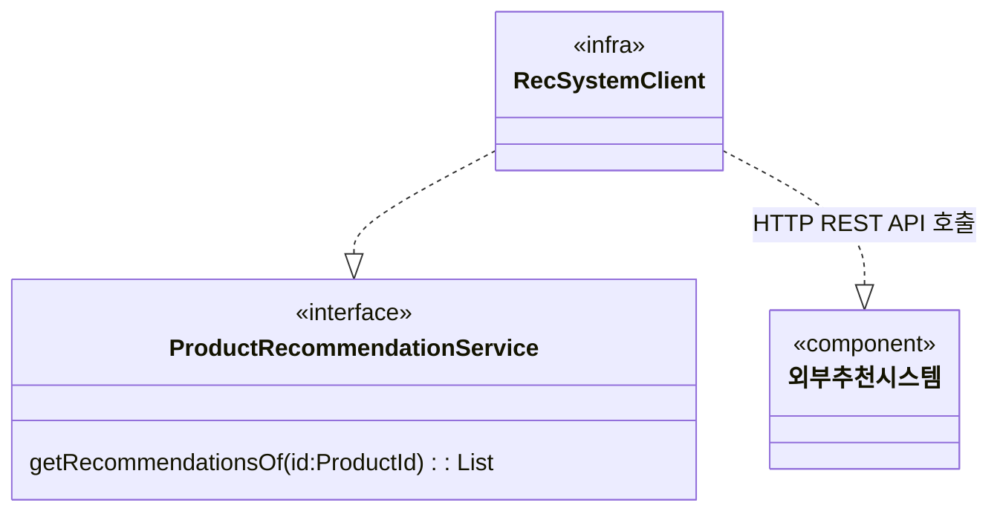
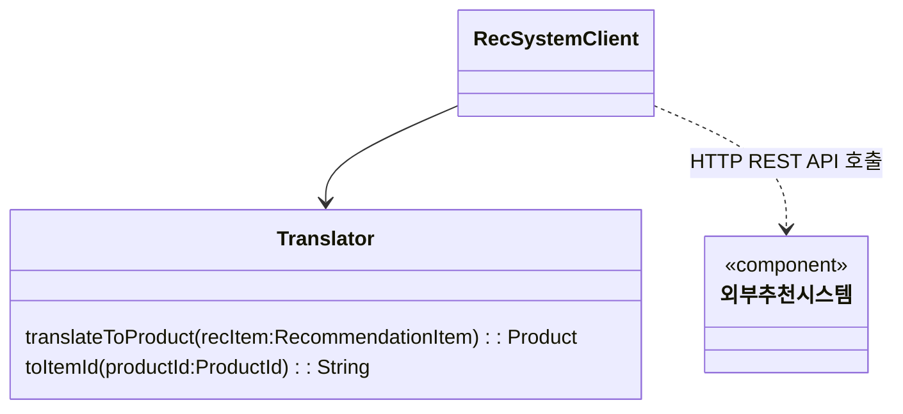
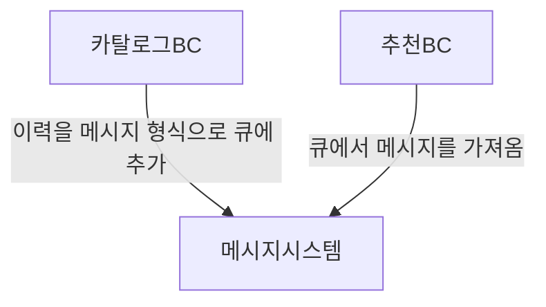
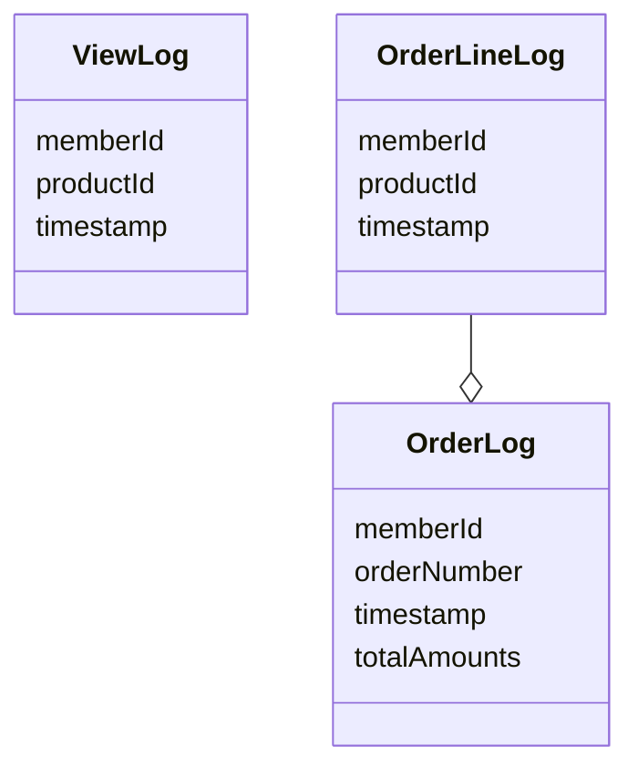

# chapter9 domain model과 bounded context


## 9.1 domain model과 경계
처음 domain model을 만들 때 빠지기 쉬운 함정이 domain을 완벽하게 표현하는 단일 model을 만드는 시도를 하는 것이다. 한 domain은 다시 여러 하위 domain으로 구분되기 때문에 한 개의 model로 여러 하위 domain을 모두 표현하려고 시도하면 오히려 모든 하위 domain에 맞지 않는 model을 만들게 된다.

예를들어
- 카탈로그에서 상품
- 재고 관리에서 상품
- 주문에서 상품
- 배송에서 상품
  은 이름만 같지 실제로 의미하는 것이 다르다.

카탈로그에서는 상품은 상품 정보가 위주다. (상품 이미지, 상품명, 상품 가격...)

재고 관리에서는 실존하는 개별 객체를 추적하기 위한 목적으로 상품을 사용한다.

논리적으로 같은 존재처럼 보이지만 하위 domain에 따라 다른 용어를 사용하는 경우도 있다.
1. 시스템을 사용하는 사람을 회원 domain에서는 회원이라고 부른다.
2. 주문 domain에서는 주문자라고 부른다.
3. 배송 domain에서는 보내는 사람이라고 부르기도 한다.

**이 처럼 같은 용어라도 의미가 다르고 같은 대상이라도 지칭하는 용어가 다를 수 있기 때문에 한 개의 model로 모든 하위 domain을 표현하려는 시도는 올바른 방법이 아니며 표현할 수도 없다.**

하위 domain마다 사용하는 용어가 다르기 때문에 올바른 domain model을 개발하려면 하위 domain 마다 model을 만들어야 한다.

model은 특정한 context 하에서 완전한 의미를 갖는다. 이렇게 구문되는 경계를 갖는 context를 DDD에서는 bounded context라고 부른다.

## 9.2 bounded context
**bounded context는 model의 경계를 결정하며 한 개의 bounded context는 논리적으로 한 개의 model을 갖는다.**

bounded context는 용어를 기준으로 구분한다. 카탈로그 context와 재고 context는 서로 다른 용어를 사용하므로 이 용어를 기준으로 context를 분리할 수 있다.

bounded context는 실제로 사용자에게 기능을 제공하는 물리적 system으로 domain model은 이 bounded context 안에서 domain을 구현한다.

이상적으로 하위 domain과 bounded context가 일대일 관계를 가지면 좋지만 그렇지 않을 때가 많다. 예를 들어 카탈로그와 재고 관리가 아직 명확하게 구분되지 않을 경우 두 하위 domain을 하나의 bounded context에서 구현하기도 한다.

한 개의 bounded context가 여러 하위 domain을 포함하더라도 하위 domain 마다 구분되는 패키지를 갖도록 구현해야 하며, 이렇게 하면 하위 domain을 위한 model이 서로 뒤섞이지 않고 하위 domain 마다 bounded context를 갖는 효과를 낼 수 있다.

bounded context는 domain model을 구분하는 경계가 되기 때문에 bounded context는 구현하는 하위 domain에 알맞은 model을 포함한다. **같은 사용자라 하더라도 주문 bounded context와 회원 bounded context가 갖는 model이 달라진다.**



## 9.3 bounded context 구현
bounded context는 domain model만 포함하는 것은 아니다. bounded context는 domain 기능을 사용자에게 제공하는 데 필요한 모든 영역이 포함된다.



모든 bounded context를 반드시 domain 주도로 개발할 필요는 없다. 상품의 리뷰는 복잡한 domain 로직을 갖지 않기 때문에 CRUD 방식으로 구현해도 된다. 즉, DAO와 데이터 중심의 value object를 이용해서 리뷰 기능을 구현해도 기능을 유지 보수하는 데 큰 문제가 없다.




## 9.4 bounded context 간 통합
매출 증대를 위해 카탈로그 하위 domain에 추천 기능을 도입하기로 했다. 기존 팀과 별도로 추천 시스템을 담당하는 팀이 새로 생겼다. 이렇게 되면 카탈로그 하위 도메인에는 카탈로그 bounded context와 추천 기능을 위한 bounded context가 생긴다.

두 팀이 관련 bounded context를 개발하면 자연스럽게 두 bounded context 간 통합이 발생한다.
- 사용자가 제품 상세 페이지를 볼 때, 보고 있는 상품과 유사한 상품 목록을 하단에 보여준다.

이때 카탈로그 context와 추천 context의 domain model은 서로 다르다.
- 카탈로그 : 제품을 중심으로 domain model 구현
- 추천 : 추천 연산을 위한 model 구현

카탈로그 시스템은 추천 시스템으로부터 추천 데이터를 받아오지만, 카탈로그 시스템에서는 추천의 domain model을 사용하기보다는 카탈로그 domain model을 사용해서 추천 상품을 표현해야 한다.
```java
public interface ProductRecommendationService {
	List<Product> getRecommendationsOf(ProductId id);
}
```

domain service를 구현한 class는 infrastructure 영역에 위치한다. 이 class는 외부 시스템과의 연동을 처리하고 외부 시스템의 model과 현재 domain model 간의 변환을 책임진다.


REST API가 제공하는 데이터는 추천 시스템의 모델을 기반으로 하고 있기 때문에 API 응답은 카탈로그 domain model과 일치하지 않는 데이터를 제공할 것이다.

REST API로부터 데이터를 읽어와 카탈로그 domain에 맞는 상품 model로 변환한다.
```java
public class RecSystemClient implements ProductRecommendationService {
	private ProductRepository productRepository;

	@Override
	public List<Product> getRecommendationsOf(ProductId id) {
		List<RecommendationItem> items = getRecItems(id.getValue());
		return toProducts(items);
	}

	private List<RecommendationItem> getRecItems(String itemId) {
		return externalRecClient.getRecs(itemId);
	}

	private List<Product> toProducts(List<RecommendationItem> items) {
		return items.stream()
				.map(item -> toProductId(item.getItemId()))
				.map(prodId -> productRepository.findById(prodId))
				.collect(toList());
	}

	private ProductId toProductId(String itemId) {
		return new ProductId(itemId);
	}
}
```

두 model 간의 변화 과정이 복잡하면 변환 처리를 위한 별도 class를 만들고 이 class에서 변환을 처리해도 된다.


REST API를 호출하는 것은 두 bounded context를 직접 통합하는 방법이다. 메시지 큐를 사용해서 간접적으로 통합하는 방법도 있다.


추천 bounded context는 큐에서 이력 메시지를 읽어와 추천을 계산하는 데 사용한다.

이것은 **두 bounded context가 사용할 메시지의 데이터 구조를 맞춰야 함**을 의미한다.



## 9.5 bounded context 간 관계
(지금까지한 내용을 정리하는 부분이라 생략)

## 9.6 context map
개별 bounded context에 매몰되면 전체를 보지 못할 때가 있다.

context map은 bounded context 간의 관계를 표시한 것이다.